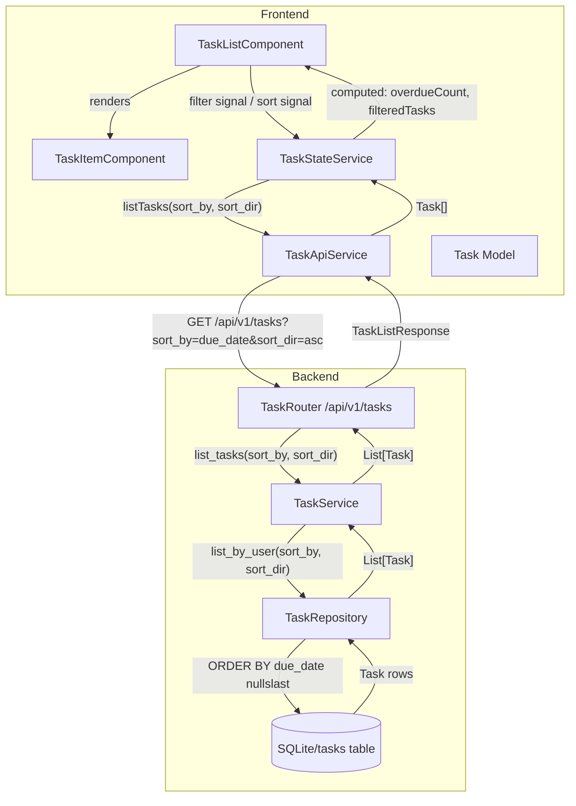
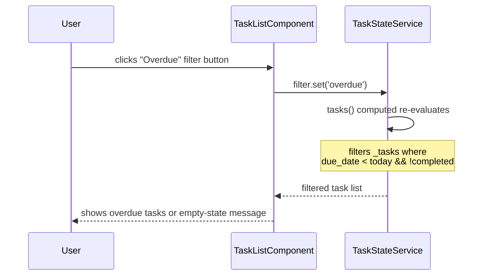
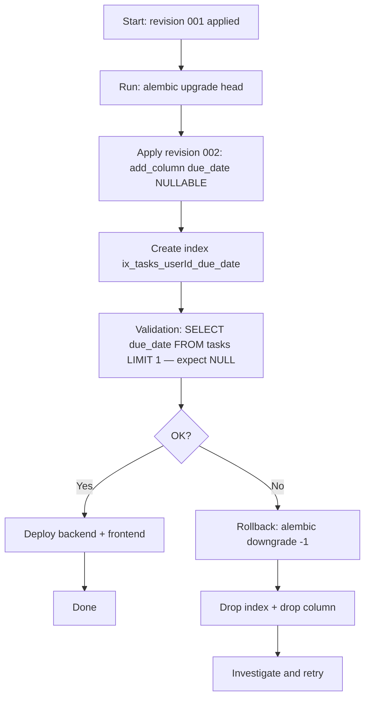

# Design Document: Due Dates + Overdue Filter

## Overview

This feature adds deadline management to the Todo App by introducing an optional `due_date` field on tasks, a dedicated overdue filter, a live overdue count badge, and due-date sorting. Users can assign, view, and clear due dates on individual tasks; the application automatically classifies tasks as overdue when their due date has passed and they remain incomplete.

**Purpose**: This feature delivers time-sensitive task awareness to all authenticated users. It surfaces overdue work proactively and enables deadline-driven prioritization through sorting and filtering controls.

**Users**: All authenticated users of the Todo App will use this feature to manage personal deadlines and quickly identify which tasks require immediate attention.

**Impact**: Adds a `due_date DATETIME NULL` column to the `tasks` table (additive, non-breaking migration); extends existing API schemas, repository, service, and all four frontend layers (model, API service, state service, components).

### Goals

- Allow users to assign, edit, and remove an optional due date on any task (requirements 1.1–1.6)
- Display due dates on task cards in a consistent, human-readable format (requirements 2.1–2.3)
- Auto-detect and visually mark overdue tasks client-side without page reload (requirements 3.1–3.4)
- Provide an "Overdue" filter button with empty-state handling (requirements 4.1–4.5)
- Show a live numeric badge reflecting the current overdue count (requirements 5.1–5.3)
- Sort task lists by due date ASC/DESC at the database level, with null-last ordering (requirements 6.1–6.8)
- Ensure all new UI elements are keyboard-navigable and screen-reader accessible (requirements 7.1–7.3)

### Non-Goals

- Recurring due dates or reminders/notifications
- Server-side push of overdue status (polling or WebSocket)
- A dedicated backend endpoint for overdue tasks — detection is client-side
- Timezone-aware due dates (date-only granularity is sufficient)
- Pagination or virtual scrolling for the sorted task list

---

## Architecture

### Existing Architecture Analysis

The backend follows a strict three-layer pattern: **Router → Service → Repository**. The router handles HTTP concerns and schema validation; the service owns all business logic and ownership checks; the repository is a thin SQLAlchemy persistence adapter. This separation must be respected: sorting is a persistence concern (repository), while due-date validation and overdue classification are business concerns (service).

The frontend uses **Angular signals** for state management. `TaskStateService` owns a single `_tasks` signal; all derived views (`tasks`, `loading`) are `computed()` signals. The filter is a writable signal on the state service, consumed directly by `TaskListComponent`. This pattern extends cleanly to overdue filtering and count derivation.

### Architecture Pattern & Boundary Map



**Architecture Integration**:
- Selected pattern: Layered (Router / Service / Repository) on backend; Signals-based reactive state on frontend — both extend the existing patterns without new abstractions
- Domain boundaries: Overdue classification lives entirely in the frontend `TaskStateService` computed signal; sorting is database-level in `TaskRepository`
- Existing patterns preserved: `_get_owned_task` ownership guard, `HttpParams` builder, Pydantic `from_attributes`, standalone Angular components
- New components rationale: No new components are introduced; all changes extend existing files
- Steering compliance: No steering files found; design is consistent with patterns observed in the codebase

### Technology Stack

| Layer | Choice / Version | Role in Feature | Notes |
|-------|------------------|-----------------|-------|
| Frontend | Angular 17+, signals | Filter/sort state, overdue derivation, UI | `computed()` for overdue badge and filtered list |
| Backend | FastAPI, Pydantic v2 | Schema validation, query param handling | `Optional[date]` on request/response schemas |
| ORM | SQLAlchemy 2.x | `due_date` column, `nullslast` ordering | `Mapped[Optional[date]]` pattern |
| Database | SQLite (via Alembic) | Persists `due_date`, sorts at DB level | `DATETIME NULL`, index on `(userId, due_date)` |
| Migration | Alembic | Additive `op.add_column` | Revision `002_add_due_date` |

---

## System Flows

### Due Date Sort + Overdue Filter Request Flow

```mermaid
sequenceDiagram
    participant User
    participant TaskListComponent
    participant TaskStateService
    participant TaskApiService
    participant TaskRouter (FastAPI)
    participant TaskService
    participant TaskRepository
    participant Database

    User->>TaskListComponent: selects "Sort by due date ASC"
    TaskListComponent->>TaskStateService: sortBy.set('due_date'); sortDir.set('asc')
    TaskStateService->>TaskApiService: listTasks({ sort_by: 'due_date', sort_dir: 'asc' })
    TaskApiService->>TaskRouter (FastAPI): GET /api/v1/tasks?sort_by=due_date&sort_dir=asc
    TaskRouter (FastAPI)->>TaskService: list_tasks(user_id, sort_by='due_date', sort_dir='asc')
    TaskService->>TaskRepository: list_by_user(user_id, sort_by='due_date', sort_dir='asc')
    TaskRepository->>Database: SELECT ... ORDER BY due_date ASC NULLS LAST
    Database-->>TaskRepository: rows
    TaskRepository-->>TaskService: List[Task]
    TaskService-->>TaskRouter (FastAPI): List[Task]
    TaskRouter (FastAPI)-->>TaskApiService: TaskListResponse { tasks: [...] }
    TaskApiService-->>TaskStateService: Task[]
    TaskStateService->>TaskStateService: _tasks.set(tasks)
    TaskStateService->>TaskStateService: overdueCount recomputed (computed signal)
    TaskStateService-->>TaskListComponent: tasks() / overdueCount() updated
    TaskListComponent-->>User: re-rendered list + badge
```

### Overdue Filter Active Flow



> Overdue filtering is purely client-side. No new API call is made when switching to the "Overdue" filter; the list derives from the already-loaded `_tasks` signal.

---

## Requirements Traceability

| Requirement | Summary | Components | Interfaces | Flows |
|-------------|---------|------------|------------|-------|
| 1.1 | Create task with optional due date | `TaskItemComponent`, `TaskApiService`, `TaskService`, `TaskRepository`, `Task` (ORM) | `CreateTaskRequest.due_date`, `POST /api/v1/tasks` | — |
| 1.2 | Edit/remove due date on existing task | `TaskItemComponent`, `TaskStateService`, `TaskService` | `UpdateTaskRequest.due_date`, `PUT /api/v1/tasks/{id}` | — |
| 1.3 | Validate date format | `TaskItemComponent` (`<input type="date">`), `CreateTaskRequest`/`UpdateTaskRequest` field validator | HTML5 date input, Pydantic `date` type | — |
| 1.4 | Display validation error on invalid date | `TaskItemComponent` | Component-level error signal | — |
| 1.5 | Persist due date across sessions | `TaskRepository`, DB migration | `due_date DATETIME NULL` column | — |
| 1.6 | Removing due date saves NULL | `TaskService.update_task`, `TaskRepository.update` | `UpdateTaskRequest.due_date = null` | — |
| 2.1 | Show formatted due date label | `TaskItemComponent` | `DatePipe` `'MMM d, y'` format | — |
| 2.2 | No label when due date absent | `TaskItemComponent` (`*ngIf="task.due_date"`) | — | — |
| 2.3 | Consistent date format | `TaskItemComponent` | `DatePipe` `'MMM d, y'` | — |
| 3.1 | Overdue = past due + incomplete | `TaskStateService.isOverdue()` helper | `due_date < today && !completed` | Overdue derivation |
| 3.2 | Completed tasks never overdue | `TaskStateService.isOverdue()` | `!completed` guard | — |
| 3.3 | Visual indicator on overdue tasks | `TaskItemComponent` | CSS class + icon + `aria-label` | — |
| 3.4 | Auto-update overdue status | `TaskStateService.overdueCount`, `tasks` computed signals | `computed()` re-evaluates on `_tasks` change | — |
| 4.1 | "Overdue" filter button | `TaskListComponent` | `filter.set('overdue')` | Overdue filter flow |
| 4.2 | Filter shows only overdue tasks | `TaskStateService.tasks` computed | `filter === 'overdue'` branch | Overdue filter flow |
| 4.3 | Deactivate filter restores list | `TaskListComponent` | `filter.set('all')` | — |
| 4.4 | Visual indication filter is active | `TaskListComponent` (`[class.active]`) | `aria-pressed` on button | — |
| 4.5 | Empty state when no overdue tasks | `TaskListComponent` | `*ngIf="tasks().length === 0 && filter() === 'overdue'"` | — |
| 5.1 | Numeric overdue badge | `TaskListComponent` | `overdueCount` signal | — |
| 5.2 | Badge updates immediately | `TaskStateService.overdueCount` computed | Derived from `_tasks` signal | — |
| 5.3 | Hide badge when count is zero | `TaskListComponent` (`*ngIf="overdueCount() > 0"`) | — | — |
| 6.1 | Sort by due date ASC/DESC UI | `TaskListComponent` | `sortBy`, `sortDir` writable signals | Sort flow |
| 6.2 | Backend sort via query params | `TaskRouter`, `TaskService`, `TaskRepository` | `sort_by=due_date&sort_dir=asc\|desc` | Sort flow |
| 6.3 | Frontend sends sort params | `TaskApiService.listTasks` | `HttpParams` | Sort flow |
| 6.4 | Default ASC when first activated | `TaskStateService` | `sortDir` default `'asc'` | — |
| 6.5 | ASC: earliest first | `TaskRepository.list_by_user` | `nullslast(asc(Task.due_date))` | — |
| 6.6 | DESC: latest first | `TaskRepository.list_by_user` | `nullslast(desc(Task.due_date))` | — |
| 6.7 | Tasks without due date go last | `TaskRepository.list_by_user` | `nullslast()` SQLAlchemy function | — |
| 6.8 | Removing sort reverts to default | `TaskStateService` | `sortBy.set(null)` triggers `created_at DESC` | — |
| 7.1 | Non-color overdue indicator | `TaskItemComponent` | Warning icon + color + text label | — |
| 7.2 | Screen reader labels | `TaskItemComponent`, `TaskListComponent` | `aria-label`, `aria-pressed` | — |
| 7.3 | Keyboard navigation for due date | `TaskItemComponent` (`<input type="date">`) | Native HTML5 keyboard support | — |

---

## Components and Interfaces

### Component Summary

| Component | Layer | Intent | Req Coverage | Key Dependencies | Contracts |
|-----------|-------|--------|--------------|-----------------|-----------|
| `Task` (ORM model) | Data | Add `due_date` nullable column | 1.5 | SQLAlchemy | State |
| Alembic `002_add_due_date` | Data | Add column to DB | 1.5 | Alembic | Batch |
| `TaskCreate/Update/ResponseSchema` | Backend | Expose `due_date` in API contracts | 1.1, 1.2, 1.6 | Pydantic v2 | API |
| `TaskRepository` | Backend | Sorting with `nullslast` | 6.2, 6.5–6.7 | SQLAlchemy | Service |
| `TaskService` | Backend | Thread `due_date` through create/update | 1.1, 1.2, 1.6 | TaskRepository | Service |
| `TaskRouter` | Backend | New query params `sort_by`, `sort_dir` | 6.2 | TaskService | API |
| `Task` (TS model) | Frontend | Add `due_date` field | 1.1–1.6, 3.1 | — | State |
| `TaskApiService` | Frontend | Send sort params to API | 6.3 | HttpClient | Service |
| `TaskStateService` | Frontend | Overdue derivation, filter/sort signals | 3.1–3.4, 4.2, 5.1–5.3, 6.4, 6.8 | TaskApiService | State |
| `TaskItemComponent` | Frontend | Due date display, edit, overdue indicator | 1.1–1.4, 2.1–2.3, 3.3, 7.1–7.3 | TaskStateService | — |
| `TaskListComponent` | Frontend | Filter/sort controls, badge, empty state | 4.1, 4.3–4.5, 5.1–5.3, 6.1 | TaskStateService | — |

---

### Database Layer

#### Alembic Migration `002_add_due_date`

| Field | Detail |
|-------|--------|
| Intent | Add nullable `due_date` column to the `tasks` table |
| Requirements | 1.5 |

**Responsibilities & Constraints**
- Single additive migration: `op.add_column` with `nullable=True` and no server default
- Existing rows will have `due_date = NULL` — correct "no deadline" semantic
- Adds a composite index `ix_tasks_userId_due_date` on `(userId, due_date)` to support efficient sorted queries per user
- Downgrade removes the index then drops the column

**Contracts**: Batch [x]

##### Batch / Job Contract
- Trigger: Alembic `upgrade head`
- Input / validation: None (DDL only)
- Output / destination: `tasks` table gains `due_date DATETIME NULL`; index `ix_tasks_userId_due_date` created
- Idempotency and recovery: Standard Alembic version tracking; `downgrade` reverses with `op.drop_index` + `op.drop_column`

**Migration definition (structure, not final code)**:
```
revision = "002"
down_revision = "001"

upgrade:
  op.add_column("tasks", sa.Column("due_date", sa.DateTime(), nullable=True))
  op.create_index("ix_tasks_userId_due_date", "tasks", ["userId", "due_date"])

downgrade:
  op.drop_index("ix_tasks_userId_due_date", table_name="tasks")
  op.drop_column("tasks", "due_date")
```

---

#### `Task` ORM Model (extended)

| Field | Detail |
|-------|--------|
| Intent | Add `due_date` mapped column to the SQLAlchemy `Task` model |
| Requirements | 1.5, 3.1 |

**Responsibilities & Constraints**
- Add `due_date: Mapped[Optional[date]]` using `mapped_column(DateTime, nullable=True, default=None)`
- Column stores date at day granularity; time component is irrelevant and may be midnight UTC
- No other columns change

**Implementation Notes**
- Use `from datetime import date` and `Optional` from `typing`
- `Mapped[Optional[date]]` with `mapped_column(DateTime, nullable=True)` follows existing column pattern

---

### Backend Layer

#### `TaskCreate` / `UpdateTaskRequest` / `TaskResponse` Schemas

| Field | Detail |
|-------|--------|
| Intent | Expose optional `due_date` on all task-related Pydantic schemas |
| Requirements | 1.1, 1.2, 1.3, 1.6, 2.1 |

**Responsibilities & Constraints**
- `CreateTaskRequest`: add `due_date: Optional[date] = None`
- `UpdateTaskRequest`: add `due_date: Optional[date] = None`
- `TaskResponse`: add `due_date: Optional[date] = None`; serializes as `"YYYY-MM-DD"` in JSON automatically via Pydantic's `date` type
- Invalid date strings are rejected by Pydantic with HTTP 422 before reaching the service layer (satisfies requirement 1.3 and 1.4 at the API boundary)

**Contracts**: API [x]

##### API Contract

| Method | Endpoint | Request (added fields) | Response (added fields) | Errors |
|--------|----------|------------------------|------------------------|--------|
| POST | `/api/v1/tasks` | `due_date?: string \| null` (`YYYY-MM-DD`) | `due_date?: string \| null` | 422 on invalid date |
| PUT | `/api/v1/tasks/{id}` | `due_date?: string \| null` | `due_date?: string \| null` | 422 on invalid date, 403, 404 |
| GET | `/api/v1/tasks` | `sort_by=due_date`, `sort_dir=asc\|desc` (query) | `due_date` in each task | 422 on invalid sort params |

**Implementation Notes**
- All existing fields and validation remain unchanged
- `TaskResponse.model_config = {"from_attributes": True}` already set — Pydantic will serialize `Task.due_date` automatically

---

#### `TaskRepository` (extended)

| Field | Detail |
|-------|--------|
| Intent | Add `due_date` persistence to `create`/`update` and implement sortable `list_by_user` |
| Requirements | 1.5, 6.2, 6.5, 6.6, 6.7 |

**Responsibilities & Constraints**
- `create(user_id, task_id, title, due_date)` — passes `due_date` to `Task()` constructor; default `None`
- `update(task)` — unchanged; caller sets `task.due_date` before calling
- `list_by_user(user_id, status, sort_by, sort_dir)` — conditionally applies `ORDER BY` based on `sort_by`; always uses `nullslast` to send NULL rows to the end; falls back to `created_at DESC` when `sort_by` is not `'due_date'`

**Dependencies**
- Inbound: `TaskService` — calls repository methods (P0)
- External: `sqlalchemy.nullslast`, `sqlalchemy.asc`, `sqlalchemy.desc` — ordering functions (P0)

**Contracts**: Service [x]

##### Service Interface

```python
class TaskRepository:
    def create(
        self,
        user_id: str,
        task_id: str,
        title: str,
        due_date: Optional[date] = None,
    ) -> Task: ...

    def list_by_user(
        self,
        user_id: str,
        status: Optional[bool],
        sort_by: Optional[str] = None,
        sort_dir: str = "asc",
    ) -> List[Task]: ...
```

- Preconditions: `sort_by` is either `None` or `"due_date"`; `sort_dir` is `"asc"` or `"desc"`
- Postconditions: When `sort_by == "due_date"`, returned list is ordered by `due_date` (direction per `sort_dir`), with NULL values last
- Invariants: `status` filter behaviour unchanged

**Implementation Notes**
- Ordering logic: `from sqlalchemy import nullslast, asc, desc`. Apply `nullslast(asc(Task.due_date))` or `nullslast(desc(Task.due_date))`.
- Guard against injection: `sort_by` and `sort_dir` must be validated in the router or service before reaching the repository.

---

#### `TaskService` (extended)

| Field | Detail |
|-------|--------|
| Intent | Thread `due_date` through create/update operations and validate sort parameters |
| Requirements | 1.1, 1.2, 1.6, 6.2 |

**Responsibilities & Constraints**
- `create_task(user_id, title, due_date)` — passes `due_date` to `task_repo.create()`
- `update_task(task_id, user_id, title, due_date)` — sets `task.due_date = due_date` (None clears it) before calling `task_repo.update()`
- `list_tasks(user_id, status, sort_by, sort_dir)` — validates `sort_by` (allowed: `None`, `"due_date"`) and `sort_dir` (allowed: `"asc"`, `"desc"`); raises `ValidationError` on invalid values; passes to repository

**Contracts**: Service [x]

##### Service Interface

```python
class TaskService:
    def create_task(
        self,
        user_id: str,
        title: str,
        due_date: Optional[date] = None,
    ) -> Task: ...

    def update_task(
        self,
        task_id: str,
        user_id: str,
        title: str,
        due_date: Optional[date] = None,
    ) -> Task: ...

    def list_tasks(
        self,
        user_id: str,
        status: Optional[str] = None,
        sort_by: Optional[str] = None,
        sort_dir: str = "asc",
    ) -> List[Task]: ...
```

- Preconditions: `sort_by` is `None` or `"due_date"`; `sort_dir` is `"asc"` or `"desc"` (validated here)
- Postconditions: `update_task` with `due_date=None` stores NULL (clears deadline)
- Invariants: Ownership check (`_get_owned_task`) still runs before any mutation

---

#### `TaskRouter` (extended)

| Field | Detail |
|-------|--------|
| Intent | Accept and forward `sort_by` and `sort_dir` query parameters; pass `due_date` from request bodies |
| Requirements | 6.2, 1.1, 1.2 |

**Contracts**: API [x]

##### API Contract

| Method | Endpoint | Query Params | Request Body (new) | Notes |
|--------|----------|--------------|--------------------|-------|
| GET | `/api/v1/tasks` | `sort_by: str \| None`, `sort_dir: "asc"\|"desc"` default `"asc"` | — | Validated by Literal type or Enum |
| POST | `/api/v1/tasks` | — | `due_date: date \| None` | Optional field |
| PUT | `/api/v1/tasks/{id}` | — | `due_date: date \| None` | Optional field, None clears |

**Implementation Notes**
- Use `Query(default=None, pattern="^due_date$")` or `Literal["due_date"] | None` for `sort_by` to prevent arbitrary column injection
- Use `Literal["asc", "desc"]` for `sort_dir`
- Risk: Accepting arbitrary `sort_by` strings could expose column injection; mitigate by allowlist in router and service

---

### Frontend Layer

#### `Task` TypeScript Model (extended)

| Field | Detail |
|-------|--------|
| Intent | Add optional `due_date` field to the frontend task interface |
| Requirements | 1.1–1.6, 2.1, 3.1 |

**Contracts**: State [x]

##### State Management

```typescript
export interface Task {
  id: string;
  userId: string;
  title: string;
  completed: boolean;
  due_date?: string | null;  // ISO 8601 date "YYYY-MM-DD" or null/undefined
}

export interface CreateTaskRequest {
  title: string;
  due_date?: string | null;
}

export interface UpdateTaskRequest {
  title: string;
  due_date?: string | null;
}

export type TaskSortDir = 'asc' | 'desc';
export type TaskSortBy = 'due_date' | null;
```

- State model: Plain interface; `due_date` is an ISO date string received from the API
- Persistence: Serialized by the API; no frontend storage
- Concurrency strategy: N/A — signals ensure consistent reads

---

#### `TaskApiService` (extended)

| Field | Detail |
|-------|--------|
| Intent | Accept sort parameters in `listTasks` and `due_date` in create/update |
| Requirements | 6.3, 1.1, 1.2 |

**Dependencies**
- Inbound: `TaskStateService` — calls all methods (P0)
- External: `HttpClient` — Angular HTTP (P0)

**Contracts**: Service [x]

##### Service Interface

```typescript
interface TaskApiService {
  listTasks(
    status?: TaskStatus,
    sortBy?: TaskSortBy,
    sortDir?: TaskSortDir,
  ): Observable<Task[]>;

  createTask(title: string, dueDate?: string | null): Observable<Task>;

  updateTask(
    taskId: string,
    title: string,
    dueDate?: string | null,
  ): Observable<Task>;
}
```

- Preconditions: `sortBy` is `'due_date'` or omitted; `sortDir` is `'asc'` or `'desc'`
- Postconditions: `listTasks` appends `sort_by` and `sort_dir` to `HttpParams` when `sortBy` is set
- Invariants: Existing `toggleCompletion` and `deleteTask` signatures unchanged

**Implementation Notes**
- `HttpParams` is immutable; use the chain `.set()` pattern already present in the service
- `dueDate` should be sent as a string or omitted entirely from the body when `null`/`undefined`

---

#### `TaskStateService` (extended)

| Field | Detail |
|-------|--------|
| Intent | Add overdue derivation, overdue count badge, overdue filter support, and sort state |
| Requirements | 3.1–3.4, 4.2–4.5, 5.1–5.3, 6.1, 6.3, 6.4, 6.8 |

**Responsibilities & Constraints**
- Extends `filter` type to `'all' | 'pending' | 'completed' | 'overdue'`
- Adds writable signals `sortBy: WritableSignal<TaskSortBy>` and `sortDir: WritableSignal<TaskSortDir>`
- Derives `overdueCount: Signal<number>` as a `computed()` from `_tasks`
- `tasks` computed signal gains an `'overdue'` branch using `isOverdue()` helper
- `loadTasks()` is updated to pass `sortBy()` and `sortDir()` to `TaskApiService.listTasks`
- `createTask` and `updateTask` updated to accept and forward `dueDate`

**Dependencies**
- Inbound: `TaskListComponent`, `TaskItemComponent` — read signals and call methods (P0)
- Outbound: `TaskApiService` — all data fetching and mutations (P0)

**Contracts**: State [x]

##### State Management

```typescript
interface TaskStateService {
  // Existing signals (types extended)
  readonly loading: Signal<boolean>;
  readonly filter: WritableSignal<'all' | 'pending' | 'completed' | 'overdue'>;

  // New signals
  readonly sortBy: WritableSignal<TaskSortBy>;        // null | 'due_date'
  readonly sortDir: WritableSignal<TaskSortDir>;      // 'asc' | 'desc'
  readonly overdueCount: Signal<number>;              // computed

  // Existing (return type unchanged)
  readonly tasks: Signal<Task[]>;

  // Methods (extended signatures)
  loadTasks(): Observable<void>;
  createTask(title: string, dueDate?: string | null): Observable<Task>;
  updateTask(taskId: string, title: string, dueDate?: string | null): Observable<Task>;

  // Unchanged
  toggleCompletion(taskId: string): Observable<Task>;
  deleteTask(taskId: string): Observable<void>;
}
```

- State model:
  - `_tasks`: canonical task array signal; source of truth
  - `overdueCount`: `computed(() => _tasks().filter(isOverdue).length)`
  - `tasks`: `computed()` extends existing filter logic with `'overdue'` branch
  - `sortBy` / `sortDir`: writable, read by `loadTasks()` on every call
- Persistence: `_tasks` is in-memory only; reloaded via `loadTasks()` on `sortBy`/`sortDir` change
- Concurrency strategy: Angular signals are synchronous; no race conditions on filter/sort changes

**Overdue helper (logic specification)**:
```
isOverdue(task: Task): boolean =>
  task.due_date != null
  && !task.completed
  && task.due_date < todayISO()

todayISO(): string =>
  new Date().toISOString().slice(0, 10)   // "YYYY-MM-DD"
```

**Implementation Notes**
- `loadTasks()` should be called reactively when `sortBy` or `sortDir` changes. Use Angular's `effect()` or wire the sort buttons to call `loadTasks()` directly after updating signals.
- `overdueCount` re-evaluates on every `_tasks` update, satisfying requirement 3.4 and 5.2 without polling.

---

#### `TaskItemComponent` (extended)

| Field | Detail |
|-------|--------|
| Intent | Display due date label, date picker in edit mode, and overdue visual indicator |
| Requirements | 1.1–1.4, 2.1–2.3, 3.3, 7.1–7.3 |

**Responsibilities & Constraints**
- View mode: render `due_date` as `"Apr 10, 2026"` using Angular `DatePipe`; hide label when absent (requirement 2.2); apply overdue CSS class + warning icon + `aria-label="Overdue"` when `isOverdue` (requirements 3.3, 7.1, 7.2)
- Edit mode: add `<input type="date">` bound to `editDueDate` local field; validation error displayed inline when the browser reports an invalid date (requirement 1.3, 1.4); clearing the field sets `due_date` to `null` (requirement 1.6)
- Keyboard navigation: `<input type="date">` provides native keyboard support in all major browsers (requirement 7.3)

**Contracts**: (presentation only — no contract subsections required)

**Implementation Notes**

Due date label (view mode):
```
<span *ngIf="task.due_date" class="due-date-label" [attr.aria-label]="'Due: ' + (task.due_date | date:'MMM d, y')">
  {{ task.due_date | date:'MMM d, y' }}
</span>
```

Overdue indicator (view mode, shown in addition to label):
```
<span *ngIf="isOverdue(task)"
      class="overdue-indicator"
      aria-label="Overdue"
      role="img">
  ⚠ Overdue
</span>
```

CSS: `overdue-indicator` uses `color: #c0392b` (red) plus bold/underline so the indicator is not color-only (requirement 7.1).

Edit mode date input:
```
<input type="date" [(ngModel)]="editDueDate" name="editDueDate"
       aria-label="Due date" />
```

`isOverdue(task)` delegates to the same pure helper as `TaskStateService` for consistency.

---

#### `TaskListComponent` (extended)

| Field | Detail |
|-------|--------|
| Intent | Add "Overdue" filter button, overdue count badge, sort controls, and empty-state for overdue filter |
| Requirements | 4.1–4.5, 5.1–5.3, 6.1 |

**Responsibilities & Constraints**
- Adds "Overdue" button to the existing filter controls row; uses `[class.active]` and `[attr.aria-pressed]` for state indication (requirements 4.1, 4.4, 7.2)
- Renders `overdueCount` badge next to the "Overdue" button, hidden when zero (requirements 5.1–5.3)
- Adds sort controls: a "Sort by due date" button that toggles between ASC and DESC; clicking it sets `sortBy('due_date')` and calls `loadTasks()`; a "Clear sort" option resets `sortBy(null)` (requirements 6.1, 6.8)
- Renders an overdue-specific empty-state message when filter is `'overdue'` and `tasks().length === 0` (requirement 4.5)

**Implementation Notes**

Overdue filter button with badge:
```
<button
  data-testid="filter-overdue"
  [class.active]="taskState.filter() === 'overdue'"
  [attr.aria-pressed]="taskState.filter() === 'overdue'"
  (click)="taskState.filter.set('overdue')"
>
  Overdue
  <span *ngIf="taskState.overdueCount() > 0" class="badge" aria-live="polite">
    {{ taskState.overdueCount() }}
  </span>
</button>
```

Sort control:
```
<button
  data-testid="sort-due-date"
  [class.active]="taskState.sortBy() === 'due_date'"
  [attr.aria-label]="'Sort by due date ' + taskState.sortDir()"
  (click)="toggleDueDateSort()"
>
  Due Date {{ taskState.sortBy() === 'due_date' ? (taskState.sortDir() === 'asc' ? '↑' : '↓') : '' }}
</button>
```

Overdue empty state:
```
<div *ngIf="taskState.tasks().length === 0 && taskState.filter() === 'overdue'"
     data-testid="overdue-empty-state" class="empty-state">
  No overdue tasks. You are all caught up!
</div>
```

---

## Data Models

### Domain Model

The `Task` aggregate gains a new `due_date` value object (a date). Overdue status is a derived property — not stored — computed as `due_date < today && !completed`. The business invariant is: a task is never overdue if `completed = true`, regardless of `due_date`.

### Logical Data Model

```
Task
  id          : UUID (PK)
  userId      : UUID (FK → users.id, CASCADE DELETE)
  title       : string (1–255 chars, non-empty)
  completed   : boolean (default false)
  created_at  : datetime (server default NOW)
  due_date    : date | null  ← NEW
```

Cardinality: one user → many tasks; `due_date` is a property of the task, not a separate entity.

### Physical Data Model

**Relational schema change**:

```sql
ALTER TABLE tasks ADD COLUMN due_date DATETIME NULL;
CREATE INDEX ix_tasks_userId_due_date ON tasks (userId, due_date);
```

Index rationale: The most common query is `WHERE userId = ? ORDER BY due_date`, making the composite index optimal. The existing `ix_tasks_userId` index remains; the new index supplements it for sorted queries.

### Data Contracts and Integration

**API Data Transfer**

- `due_date` serialized as `"YYYY-MM-DD"` string (Pydantic `date` type JSON encoding)
- Absence of `due_date` in a `PUT` body is interpreted as "keep existing value" only if the schema uses `exclude_unset`; if not, `None` is explicit "clear"

Clarification: `UpdateTaskRequest.due_date` is `Optional[date] = None`. A client that omits the field will send `None`, which clears the due date. This is the correct semantic for requirement 1.6. The frontend must always include `due_date` in PUT requests (either a date string or `null`).

---

## Error Handling

### Error Strategy

Due-date errors are primarily user input errors caught at two boundaries: the frontend HTML5 `<input type="date">` (prevents invalid date entry), and the Pydantic schema (rejects malformed JSON dates with 422). No new system error categories are introduced.

### Error Categories and Responses

**User Errors (4xx)**
- Invalid `due_date` format in API request → Pydantic raises 422 with field-level detail `"Input should be a valid date"`; frontend shows inline error message in edit form (requirement 1.4)
- Invalid `sort_by` value → Pydantic / FastAPI `Literal` type raises 422 with detail; frontend never sends invalid values (controlled by UI)
- Invalid `sort_dir` value → Same as above

**Business Logic Errors**
- None introduced; overdue classification is read-only and never triggers an error

### Monitoring

- No new error types require dedicated monitoring beyond the existing FastAPI exception handlers
- Frontend console errors for failed task loads (network) follow the existing `catchError` + `throwError` pattern in `TaskStateService`

---

## Testing Strategy

### Unit Tests

1. `TaskRepository.list_by_user`: verify `nullslast(asc)` ordering — tasks with `due_date` appear before `NULL` rows; verify `nullslast(desc)` ordering; verify fallback to `created_at DESC` when `sort_by=None`
2. `TaskService.list_tasks`: verify `ValidationError` raised for unknown `sort_by` or `sort_dir` values
3. `TaskService.update_task`: verify `due_date=None` clears the field; verify a valid date is persisted
4. `TaskStateService.overdueCount`: verify count increments when a task with past `due_date` and `completed=false` is present; verify count does not include completed tasks; verify count updates after `toggleCompletion`
5. `TaskStateService.tasks` with filter `'overdue'`: verify only past-due, incomplete tasks are returned; verify empty array when none qualify

### Integration Tests

1. `POST /api/v1/tasks` with `due_date`: verify 201 response includes `due_date` field; verify 422 on malformed date
2. `PUT /api/v1/tasks/{id}` with `due_date=null`: verify response has `due_date: null`
3. `GET /api/v1/tasks?sort_by=due_date&sort_dir=asc`: verify tasks ordered earliest-first, null-last
4. `GET /api/v1/tasks?sort_by=due_date&sort_dir=desc`: verify tasks ordered latest-first, null-last
5. `GET /api/v1/tasks?sort_by=unknown`: verify 422 response

### E2E / UI Tests

1. Create a task with a due date → verify due date label appears on task card in `"MMM d, y"` format
2. Edit a task to remove its due date → verify label disappears
3. With a past-due incomplete task present → verify overdue indicator (icon + text) is visible and overdue badge shows correct count
4. Activate "Overdue" filter → verify only overdue tasks shown; verify `aria-pressed="true"` on button
5. Activate "Overdue" filter with no overdue tasks → verify overdue-specific empty-state message is displayed
6. Sort by due date ASC → verify API called with `sort_by=due_date&sort_dir=asc`; verify list order
7. Set a due date using only keyboard → verify field focusable and submittable without pointer

---

## Migration Strategy



- Phase 1: Run Alembic migration (additive, zero-downtime — existing rows get NULL)
- Phase 2: Deploy backend (new schema fields are backwards-compatible; old API clients receive `due_date: null`)
- Phase 3: Deploy frontend (reads and displays `due_date` from API)
- Rollback trigger: Any migration error or schema validation failure
- No data backfill required

---

## Supporting References

- SQLAlchemy `nullslast` / `nullsfirst` documentation: [SQLAlchemy Core — Column Elements and Expressions](https://docs.sqlalchemy.org/en/20/core/sqlelement.html#sqlalchemy.sql.expression.nullslast)
- Angular `DatePipe` format tokens: [Angular DatePipe reference](https://angular.dev/api/common/DatePipe)
- Background investigation notes: `/home/dcastelhano/elevate/projetos/todo_app/.sdd/specs/due-dates-overdue-filter/research.md`
