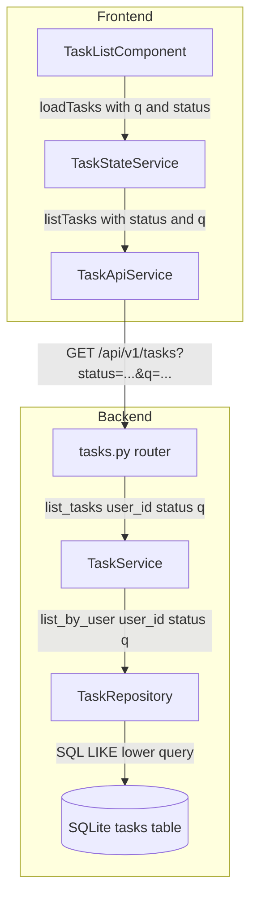
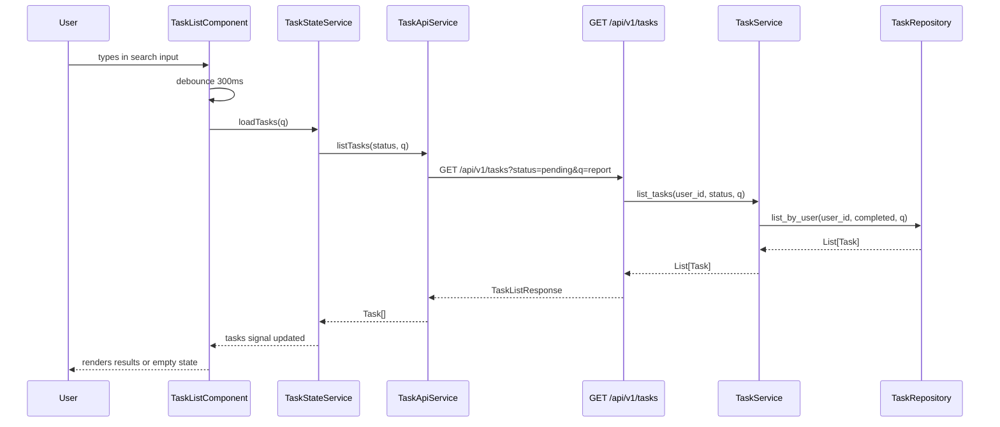
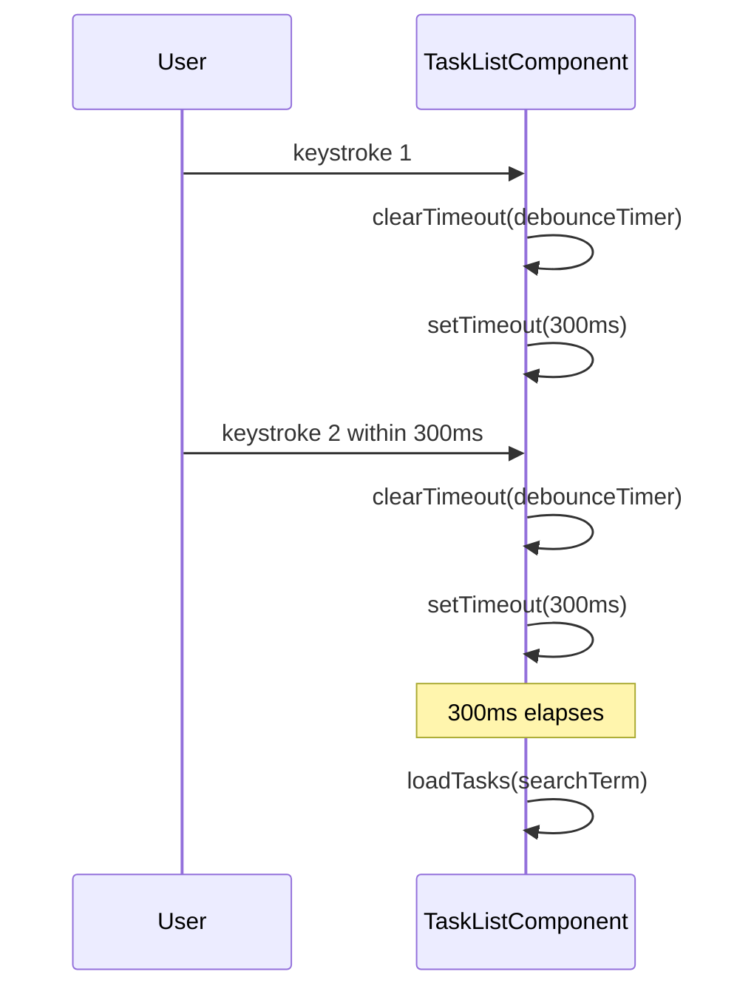

# Design Document — Search Feature

## Overview

The Search feature extends the Task Flow task management application to allow authenticated users to find tasks instantly by typing a keyword. The backend API gains an optional `q` query parameter on `GET /api/v1/tasks` that applies a case-insensitive `LIKE` filter on the `title` column, composing transparently with the existing `status` filter. The Angular frontend gains a debounced search input rendered above the status filter buttons inside `TaskListComponent`, and an updated empty state that displays the search term when no results are found.

**Users**: All authenticated Task Flow users benefit from this feature when scanning large task lists. The workflow is fully self-contained within the existing task list view — no new routes or pages are required.

**Impact**: Three backend layers (`tasks.py` router, `TaskService`, `TaskRepository`) receive additive parameter changes, and three frontend layers (`TaskApiService`, `TaskStateService`, `TaskListComponent`) receive additive interface and template changes. No existing behavior or tests are broken; the `q` parameter is strictly optional throughout.

### Goals

- Enable case-insensitive, title-based task search scoped to the authenticated user.
- Compose search with the existing status filter without resetting either when the other changes.
- Debounce frontend keystrokes at 300 ms to minimize redundant API calls.
- Display a contextual empty state message that echoes the active search term when no results are returned.

### Non-Goals

- Full-text search across fields other than `title` (description, labels, metadata).
- Search result highlighting or excerpt generation.
- Search history, saved searches, or autocomplete suggestions.
- Pagination or cursor-based result sets for search responses.
- Client-side filtering without an API round-trip.

---

## Requirements Traceability

| Requirement | Summary | Components | Interfaces | Flows |
|-------------|---------|------------|------------|-------|
| 1.1 | API accepts optional `q` param | `tasks.py` router | `GET /api/v1/tasks` | Search Request Flow |
| 1.2 | LIKE filter applied when `q` non-empty | `TaskRepository` | `list_by_user` | Search Request Flow |
| 1.3 | No filter when `q` absent or empty | `TaskService` | `list_tasks` | Search Request Flow |
| 1.4 | `q` and `status` compose simultaneously | `TaskRepository`, `TaskService` | `list_by_user`, `list_tasks` | Search Request Flow |
| 1.5 | Empty list returned (not error) on no match | `TaskRepository` | `list_by_user` | Search Request Flow |
| 1.6 | Results always scoped to authenticated user | `tasks.py` router | `GET /api/v1/tasks` | Search Request Flow |
| 2.1 | SQL `LIKE` on `title` column | `TaskRepository` | `list_by_user` | — |
| 2.2 | Case-insensitive match via `lower()` | `TaskRepository` | `list_by_user` | — |
| 2.3 | Title filter chains with `completed` filter | `TaskRepository` | `list_by_user` | — |
| 2.4 | `ORDER BY created_at DESC` preserved | `TaskRepository` | `list_by_user` | — |
| 3.1 | `list_tasks` accepts optional `q` | `TaskService` | `list_tasks` | — |
| 3.2 | Non-empty `q` passed to repository | `TaskService` | `list_tasks` | — |
| 3.3 | None/empty/whitespace `q` → `None` to repo | `TaskService` | `list_tasks` | — |
| 4.1 | Search input rendered above filter buttons | `TaskListComponent` | Component template | — |
| 4.2 | Placeholder text communicates purpose | `TaskListComponent` | Component template | — |
| 4.3 | Leading search icon from Material Symbols | `TaskListComponent` | Component template | — |
| 4.4 | Clear icon resets search term | `TaskListComponent` | Component template | — |
| 4.5 | Clear icon triggers reload without `q` | `TaskListComponent` | `loadTasks()` | Search Request Flow |
| 4.6 | `TaskListComponent` owns search term state | `TaskListComponent` | `searchTerm` field | — |
| 5.1 | 300 ms debounce before `loadTasks()` fires | `TaskListComponent` | `onSearchInput()` | Debounce Flow |
| 5.2 | Pending debounce cancelled on new keystroke | `TaskListComponent` | `onSearchInput()` | Debounce Flow |
| 5.3 | `loadTasks()` passes `q` to `TaskStateService` | `TaskStateService` | `loadTasks(q?)` | Debounce Flow |
| 5.4 | `TaskApiService` appends `q` as query param | `TaskApiService` | `listTasks(status?, q?)` | Debounce Flow |
| 5.5 | Clear (empty) triggers reload without `q` | `TaskListComponent` | `onSearchInput()` | Debounce Flow |
| 6.1 | Empty list + active search → "No results for '…'" | `TaskListComponent` | Component template | Empty State Flow |
| 6.2 | Message includes exact keyword in single quotes | `TaskListComponent` | Component template | Empty State Flow |
| 6.3 | Empty list + no search → default empty state | `TaskListComponent` | Component template | Empty State Flow |
| 6.4 | Loading state suppresses empty state message | `TaskListComponent` | Component template | Empty State Flow |
| 7.1 | Both `q` and `status` sent in single request | `TaskStateService`, `TaskApiService` | `loadTasks`, `listTasks` | Search Request Flow |
| 7.2 | Status filter change re-executes with current `q` | `TaskListComponent` | Filter button handlers | Search Request Flow |
| 7.3 | Search change re-executes with current status | `TaskListComponent` | `onSearchInput()` | Debounce Flow |
| 7.4 | Neither filter resets the other | `TaskListComponent` | Component state | — |

---

## Architecture

### Existing Architecture Analysis

The application follows a layered architecture on both sides of the stack:

- **Backend**: `FastAPI Router → TaskService → TaskRepository → SQLAlchemy (SQLite)`
  - The router owns HTTP concerns (query parsing, auth injection, response serialization).
  - `TaskService` owns business logic (validation, status translation, ownership enforcement).
  - `TaskRepository` owns persistence (query construction, ordering).
  - All three layers carry only the `status` parameter today.

- **Frontend**: `TaskListComponent → TaskStateService → TaskApiService → HttpClient`
  - `TaskListComponent` owns view state (`newTaskTitle`, filter button clicks) and delegates side-effects to `TaskStateService`.
  - `TaskStateService` owns in-memory task state (Angular signals), exposes a `filter` signal, and wraps API calls with optimistic update logic.
  - `TaskApiService` owns HTTP construction and delegates entirely to `HttpClient`.
  - The existing `loadTasks()` on `TaskStateService` passes `undefined` for status; the `filter` signal is read client-side for display only. **This design corrects that gap** by passing both `status` and `q` through to the API on every `loadTasks()` call.

### Architecture Pattern & Boundary Map



**Architecture Integration**:
- Selected pattern: additive parameter propagation through existing layers — each layer receives one new optional parameter (`q`) alongside the existing `status` parameter.
- Domain boundaries: search is a read concern; no write paths are modified.
- Existing patterns preserved: FastAPI `Query()` dependency injection, SQLAlchemy ORM query chaining, Angular signals + RxJS, `HttpParams` construction in `TaskApiService`.
- New components: none — all changes are extensions to existing components.
- Steering compliance: single-responsibility preserved; no cross-layer leakage.

### Technology Stack

| Layer | Choice / Version | Role in Feature | Notes |
|-------|------------------|-----------------|-------|
| Frontend | Angular (existing) with RxJS | Debounce via `setTimeout`/`clearTimeout`; signal state management | No new Angular packages required |
| Backend | FastAPI (existing) | New `Query` parameter on `GET /api/v1/tasks` | Additive; no version change |
| ORM | SQLAlchemy (existing) | `func.lower()` + `like()` on `Task.title` | SQLite-compatible; no migration required |
| HTTP | Angular `HttpClient` + `HttpParams` (existing) | Append `q` param when non-empty | Extends existing `listTasks` signature |

---

## System Flows

### Search Request Flow



### Debounce Flow



Key decisions: the debounce is implemented with a native `setTimeout` / `clearTimeout` pair stored in a component-level timer reference (`private debounceTimer: ReturnType<typeof setTimeout> | null`). This avoids importing RxJS `debounceTime` into the component and aligns with the existing non-reactive imperative style already used in `TaskListComponent` (`submitCreate` uses no observables internally).

---

## Components and Interfaces

### Summary Table

| Component | Layer | Intent | Req Coverage | Key Dependencies | Contracts |
|-----------|-------|--------|--------------|-----------------|-----------|
| `tasks.py` router | Backend / HTTP | Accept `q` query param; propagate to service | 1.1, 1.3, 1.6 | `TaskService` (P0) | API |
| `TaskService` | Backend / Business Logic | Strip whitespace from `q`; propagate to repo | 3.1, 3.2, 3.3 | `TaskRepository` (P0) | Service |
| `TaskRepository` | Backend / Persistence | Apply `lower(title) LIKE lower(%q%)` filter | 2.1, 2.2, 2.3, 2.4, 1.2, 1.4, 1.5 | SQLAlchemy `Session` (P0) | Service |
| `TaskApiService` | Frontend / HTTP | Append `q` to `HttpParams` when non-empty | 5.4, 7.1 | `HttpClient` (P0) | Service |
| `TaskStateService` | Frontend / State | Accept `q` in `loadTasks`; pass to API | 5.3, 7.1, 7.2, 7.3 | `TaskApiService` (P0) | State, Service |
| `TaskListComponent` | Frontend / View | Search input, debounce, empty state logic | 4.1–4.6, 5.1, 5.2, 5.5, 6.1–6.4, 7.2–7.4 | `TaskStateService` (P0) | — |

---

### Backend / HTTP

#### `tasks.py` router — `list_tasks` endpoint

| Field | Detail |
|-------|--------|
| Intent | Parse optional `q` query parameter and forward it to `TaskService.list_tasks` |
| Requirements | 1.1, 1.3, 1.6 |

**Responsibilities & Constraints**
- Declares `q: Optional[str] = Query(default=None, alias="q")` alongside the existing `status_filter` parameter.
- Passes `q=q` verbatim to `task_service.list_tasks`; whitespace normalization is delegated to `TaskService`.
- User scoping (`current_user.user_id`) remains unchanged and always applied.

**Dependencies**
- Outbound: `TaskService.list_tasks` — executes search with status and query (P0)

**Contracts**: API [x]

##### API Contract

| Method | Endpoint | Query Params | Response | Errors |
|--------|----------|-------------|----------|--------|
| GET | `/api/v1/tasks` | `status?: "pending"\|"completed"`, `q?: string` | `TaskListResponse` | 401 (no token), 422 (malformed token) |

- When `q` is provided and non-empty after service-layer normalization, only tasks whose `lower(title)` contains `lower(q)` are returned.
- When `q` is absent or empty, behavior is identical to the pre-search implementation.
- An empty `tasks` array is a valid 200 response; the API never returns 404 for a no-match search.

**Implementation Notes**
- Integration: add one `Query` parameter to the existing `list_tasks` function signature; call site is `task_service.list_tasks(user_id=..., status=..., q=q)`.
- Validation: FastAPI coerces `?q=` (empty string) to `""` which `TaskService` normalizes to `None`.
- Risks: none; purely additive change to an existing handler.

---

### Backend / Business Logic

#### `TaskService` — `list_tasks` method

| Field | Detail |
|-------|--------|
| Intent | Normalize the `q` parameter and pass the cleaned value to `TaskRepository` |
| Requirements | 3.1, 3.2, 3.3 |

**Responsibilities & Constraints**
- Accepts `q: Optional[str] = None` as a new keyword argument.
- Applies `q.strip()` and treats the result as `None` if it becomes empty, ensuring whitespace-only input is ignored.
- Passes `q=cleaned_q` to `self.task_repo.list_by_user`.

**Dependencies**
- Outbound: `TaskRepository.list_by_user` — persistence query with optional title filter (P0)

**Contracts**: Service [x]

##### Service Interface

```python
def list_tasks(
    self,
    user_id: str,
    status: Optional[str] = None,
    q: Optional[str] = None,
) -> List[Task]: ...
```

- Preconditions: `user_id` is a non-empty string (validated upstream by auth layer).
- Postconditions: returns a list of `Task` objects; empty list is valid when no match.
- Invariants: `q` is never passed to the repository as a whitespace-only string.

**Implementation Notes**
- Integration: add `q` parameter; normalize with `q = q.strip() if q else None`; pass to repository as `q=q`.
- Validation: whitespace normalization occurs here, not at the router level.
- Risks: none.

---

### Backend / Persistence

#### `TaskRepository` — `list_by_user` method

| Field | Detail |
|-------|--------|
| Intent | Extend the SQLAlchemy query to apply a case-insensitive title LIKE filter when `q` is provided |
| Requirements | 2.1, 2.2, 2.3, 2.4, 1.2, 1.4, 1.5 |

**Responsibilities & Constraints**
- Accepts `q: Optional[str] = None` alongside the existing `status: Optional[bool]`.
- When `q` is not `None`, appends `.filter(func.lower(Task.title).like(f"%{q.lower()}%"))` to the query chain.
- The title filter is chained after the existing `completed` filter (when both are present), preserving logical AND semantics.
- `ORDER BY Task.created_at DESC` is applied regardless of whether `q` is set.
- No SQL injection risk: `q` is embedded via SQLAlchemy's parameterized `like()` expression, not raw string interpolation.

**Dependencies**
- Inbound: `TaskService.list_tasks` — provides normalized `q` value (P0)
- External: `sqlalchemy.func.lower` — used for database-level case folding (P0, already available)

**Contracts**: Service [x]

##### Service Interface

```python
def list_by_user(
    self,
    user_id: str,
    status: Optional[bool],
    q: Optional[str] = None,
) -> List[Task]: ...
```

- Preconditions: `q`, when not `None`, is a non-empty, stripped string (guaranteed by `TaskService`).
- Postconditions: result is ordered by `created_at DESC`; may be an empty list.
- Invariants: `userId == user_id` filter always applied first; `q` filter never replaces the user scope.

**Implementation Notes**
- Integration: import `from sqlalchemy import func`; conditionally append `.filter(func.lower(Task.title).like(f"%{q.lower()}%"))`.
- Validation: the repository trusts that `TaskService` has already normalized `q`; no further stripping required here.
- Risks: SQLite `lower()` covers only ASCII letters by default. For the current use case (task titles in English), this is acceptable. Unicode case folding (e.g., `ILIKE` on PostgreSQL) can be adopted transparently when the database engine changes, without modifying the service contract.

---

### Frontend / HTTP

#### `TaskApiService` — `listTasks` method

| Field | Detail |
|-------|--------|
| Intent | Append `q` as a query string parameter when non-empty |
| Requirements | 5.4, 7.1 |

**Responsibilities & Constraints**
- Accepts an optional `q?: string` parameter alongside the existing `status?: TaskStatus`.
- Appends `params = params.set('q', q)` only when `q` is a non-empty string (truthy check).
- Does not validate or transform `q`; that responsibility belongs to the component and service layers above.

**Dependencies**
- Outbound: `HttpClient.get` — HTTP transport (P0)

**Contracts**: Service [x]

##### Service Interface

```typescript
listTasks(status?: TaskStatus, q?: string): Observable<Task[]>
```

- Preconditions: `q`, when provided, is a non-empty string (ensured by `TaskStateService`).
- Postconditions: returns an `Observable<Task[]>` from the API response's `tasks` array.
- Invariants: `status` and `q` are each appended independently; neither depends on the other being set.

**Implementation Notes**
- Integration: extend the existing `HttpParams` construction block with `if (q) { params = params.set('q', q); }` after the existing `status` block.
- Validation: empty string is falsy in TypeScript — the existing `if (status)` pattern is replicated verbatim.
- Risks: none.

---

### Frontend / State

#### `TaskStateService` — `loadTasks` method

| Field | Detail |
|-------|--------|
| Intent | Accept and forward a `q` parameter to `TaskApiService`; read `filter` signal for status |
| Requirements | 5.3, 7.1, 7.2, 7.3 |

**Responsibilities & Constraints**
- The `loadTasks` method signature changes to `loadTasks(q?: string): Observable<void>`.
- Reads `this.filter()` internally to derive the `status` argument for `TaskApiService.listTasks`.
- Passes `q` to `TaskApiService.listTasks(status, q)`.
- All other signal update logic (`_loading`, `_tasks`) is unchanged.
- The `filter` signal remains a `WritableSignal` owned by this service; it is not reset when `q` changes, and `q` is not reset when the filter changes (requirement 7.4).

**Dependencies**
- Outbound: `TaskApiService.listTasks` — HTTP request (P0)

**Contracts**: State [x], Service [x]

##### Service Interface

```typescript
loadTasks(q?: string): Observable<void>
```

- Preconditions: none; `q` may be `undefined` or a non-empty string.
- Postconditions: `_tasks` signal is updated with the API result; `_loading` is set to `false` on completion or error.
- Invariants: `filter()` is always read at call time (not cached), so filter changes are picked up on the next `loadTasks` invocation.

##### State Management

- State model: `_tasks: WritableSignal<Task[]>`, `_loading: WritableSignal<boolean>`, `filter: WritableSignal<FilterValue>`.
- The `q` value is **not stored** in `TaskStateService`; it lives as `searchTerm` in `TaskListComponent` (requirement 4.6). `TaskStateService` treats `q` as a transient call argument, not persistent state.
- Persistence: in-memory only; no local storage or session persistence.
- Concurrency: concurrent `loadTasks` calls from rapid filter + search changes resolve independently; the last response wins because signals are overwritten unconditionally. This is acceptable for the current scale.

**Implementation Notes**
- Integration: change `this.taskApi.listTasks(undefined)` to `this.taskApi.listTasks(status, q)` where `status = this.filter() !== 'all' ? this.filter() : undefined`.
- Validation: `TaskStateService` does not validate `q`; it passes the value through unchanged.
- Risks: the existing test suite for `TaskStateService` currently asserts that `loadTasks()` calls `/api/v1/tasks` without params for `filter=all`. The updated implementation preserves this behavior since `q` will be `undefined` when not provided.

---

### Frontend / View

#### `TaskListComponent`

| Field | Detail |
|-------|--------|
| Intent | Render the search input above filter buttons; manage debounced search state; display contextual empty state |
| Requirements | 4.1–4.6, 5.1, 5.2, 5.5, 6.1–6.4, 7.2–7.4 |

**Responsibilities & Constraints**
- Owns `searchTerm: string = ''` (requirement 4.6) as a component-level field (not a signal; `[(ngModel)]` binding suffices).
- Owns `private debounceTimer: ReturnType<typeof setTimeout> | null = null` for debounce management.
- `onSearchInput(value: string)` clears the existing timer and starts a new 300 ms timer that calls `this.taskState.loadTasks(this.searchTerm).subscribe()` on expiry (requirements 5.1, 5.2).
- `clearSearch()` sets `searchTerm = ''` and immediately calls `this.taskState.loadTasks().subscribe()` without waiting for the debounce (requirements 4.4, 4.5, 5.5).
- Filter button click handlers call `this.taskState.filter.set(value)` and then immediately call `this.taskState.loadTasks(this.searchTerm).subscribe()` to re-execute with both the new filter and the current search term (requirements 7.2, 7.4).
- The `ngOnInit` call changes to `this.taskState.loadTasks().subscribe()` (no `q` on initial load).
- The empty state template block is replaced with a conditional: when `searchTerm` is non-empty and tasks are empty, renders "No results for '{{searchTerm}}'"; otherwise renders the default message (requirements 6.1–6.3).
- The loading indicator suppresses the empty state entirely (requirement 6.4; already implemented via `*ngIf="!taskState.loading()"`).

**Dependencies**
- Outbound: `TaskStateService.loadTasks(q?)` — triggers API fetch (P0)
- Outbound: `TaskStateService.filter` signal — read/write for status filter (P0)
- Inbound: `TaskStateService.tasks` signal — drives task list rendering (P0)
- Inbound: `TaskStateService.loading` signal — drives loading indicator (P0)

**Contracts**: none (presentation component with no shared contract boundary)

**Implementation Notes**

- **Search input placement**: follows the UI reference at `frontend/src/ui/tasks_main_list_desktop/screen.png` — the search bar appears between the page header and the filter tabs, before the "Add Task" form. In the current component template, the search input is inserted between `<div class="task-list-header">` and `<div class="filter-controls">`.
- **UI reference markup**: the design reference (`tasks_main_list_desktop/code.html`) uses a `<div class="relative group mb-8">` wrapper with a leading `search` icon (`material-symbols-outlined`) and a trailing `close` icon. These map to `data-testid="search-input"` and `data-testid="clear-search"` respectively for testability.
- **Empty state UI reference**: `tasks_empty_state_desktop/screen.png` shows "No tasks yet." as the default empty state headline. When `searchTerm` is active, the headline changes to "No results for '{{searchTerm}}'"; the subtitle and decorative elements are omitted for the search-specific variant to keep the message focused.
- **Debounce teardown**: `ngOnDestroy` must call `clearTimeout(this.debounceTimer)` to prevent callbacks firing after the component is destroyed.
- **Filter button change**: the existing filter buttons call only `taskState.filter.set(value)` today. They must additionally call `this.taskState.loadTasks(this.searchTerm).subscribe()` so that a status change while a search is active re-runs the API query with both parameters.
- **Risks**: the `(input)` event binding on the search input fires on every keystroke; the debounce timer guards against excessive API calls, but rapid typing during slow network conditions may result in concurrent in-flight requests. This is acceptable at the current scale.

---

## Data Models

### Domain Model

The search feature introduces no new entities, value objects, or domain events. The existing `Task` aggregate remains the sole domain object. The `title` attribute gains a read access pattern (search by substring) but no structural change.

### Physical Data Model

No schema changes are required. The `tasks.title` column (`VARCHAR(255) NOT NULL`) is queried using `func.lower(Task.title).like(...)` via SQLAlchemy's ORM layer. The column already exists and carries no additional index.

**Index consideration**: a full-text or trigram index on `title` would benefit search performance at scale, but is deferred as a non-goal for this feature. The current SQLite deployment does not support these index types without extensions.

### Data Contracts & Integration

#### API Data Transfer

**Request** — `GET /api/v1/tasks`

| Parameter | Type | Location | Required | Constraint |
|-----------|------|----------|----------|------------|
| `status` | `"pending" \| "completed"` | query string | No | Ignored if absent |
| `q` | `string` | query string | No | Treated as no filter when absent or empty |

**Response** — unchanged `TaskListResponse` schema:

```json
{
  "tasks": [
    {
      "id": "uuid-string",
      "userId": "uuid-string",
      "title": "string",
      "completed": false
    }
  ]
}
```

No new response fields are added. The frontend derives empty-state messaging from the combination of `tasks.length === 0` and the presence of `searchTerm` in component state.

---

## Error Handling

### Error Strategy

The search feature is a read-only extension; errors follow the existing error handling patterns already in place.

### Error Categories and Responses

**User Errors (4xx)**
- `401 Unauthorized`: bearer token missing or expired — existing auth interceptor handles this transparently; no search-specific handling required.
- `422 Unprocessable Entity`: malformed token — same handling as existing endpoints.

**System Errors (5xx)**
- `500 Internal Server Error`: database failure during LIKE query — `TaskStateService.loadTasks` already catches errors via `catchError`, sets `loading` to `false`, and re-throws. The component should not show a stale empty state in this case; the existing error propagation path handles this.

**Frontend — no-result vs. error**
- The component distinguishes "empty results" (tasks array length 0, no error) from "request failed" (error thrown by observable). The empty state message is displayed only on a successful empty response; errors surface through the existing error flow.

### Monitoring

No additional monitoring is required beyond the existing FastAPI request logging. If tracing is introduced in the future, the `q` parameter should be included in structured log fields on the `GET /api/v1/tasks` route.

---

## Testing Strategy

### Unit Tests

**Backend**

1. `TaskRepository.list_by_user` with `q="report"` returns only tasks whose titles contain "report" (case-insensitive).
2. `TaskRepository.list_by_user` with `q=None` returns all tasks without title filter.
3. `TaskRepository.list_by_user` with both `status=False` and `q="buy"` returns only pending tasks matching the keyword.
4. `TaskService.list_tasks` with `q="  "` (whitespace) passes `q=None` to the repository.
5. `TaskService.list_tasks` with `q="Meeting"` passes `q="Meeting"` to the repository unchanged.

**Frontend**

1. `TaskApiService.listTasks` with `q="report"` sends `GET /api/v1/tasks?q=report`.
2. `TaskApiService.listTasks` with `status="pending"` and `q="report"` sends `GET /api/v1/tasks?status=pending&q=report`.
3. `TaskApiService.listTasks` with `q=""` (empty string) does not append `?q=` to the URL.
4. `TaskStateService.loadTasks("meeting")` calls `taskApi.listTasks` with the correct `status` (from `filter()`) and `q="meeting"`.
5. `TaskStateService.loadTasks()` (no argument) calls `taskApi.listTasks` with `q=undefined`, preserving backward compatibility.

### Integration Tests

1. `GET /api/v1/tasks?q=buy` returns only tasks owned by the authenticated user whose titles contain "buy" (case-insensitive).
2. `GET /api/v1/tasks?status=pending&q=buy` returns only pending tasks owned by the user matching "buy".
3. `GET /api/v1/tasks?q=nomatch` returns `{"tasks": []}` with HTTP 200.
4. `GET /api/v1/tasks?q=BUY` returns the same tasks as `?q=buy` (case-insensitive verification).
5. `GET /api/v1/tasks?q=` (empty string) returns all tasks for the user, identical to `GET /api/v1/tasks`.

### E2E / UI Tests

1. User types "groceries" in the search input; after 300 ms the task list updates to show only matching tasks.
2. User clicks the clear icon; the search input empties and the full task list reloads.
3. User types a keyword with no matching tasks; the message "No results for 'keyword'" is displayed and the default empty state is not shown.
4. User types a keyword while "Pending" filter is active; the result set respects both constraints.
5. User changes status filter while a search term is active; both filters remain applied in the new request.

---

## Security Considerations

The `q` parameter is passed to SQLAlchemy's `like()` method as a bound parameter, not via raw SQL string concatenation. This prevents SQL injection by design. No additional security controls are required for this feature beyond what the existing authentication and authorization layers already enforce (JWT validation, user scoping).

---

## Performance & Scalability

- The 300 ms debounce reduces API call frequency by suppressing intermediate keystrokes.
- The `LIKE '%q%'` pattern (leading wildcard) prevents index usage on the `title` column regardless of index type on SQLite. At the current application scale (personal task lists, typically fewer than 1,000 tasks per user), a full table scan filtered by `userId` is negligible.
- If the user base grows to tens of thousands of tasks per user, adding a SQLite FTS5 virtual table on `title` or migrating to PostgreSQL with `pg_trgm` trigram indexes would be the appropriate optimization path.
