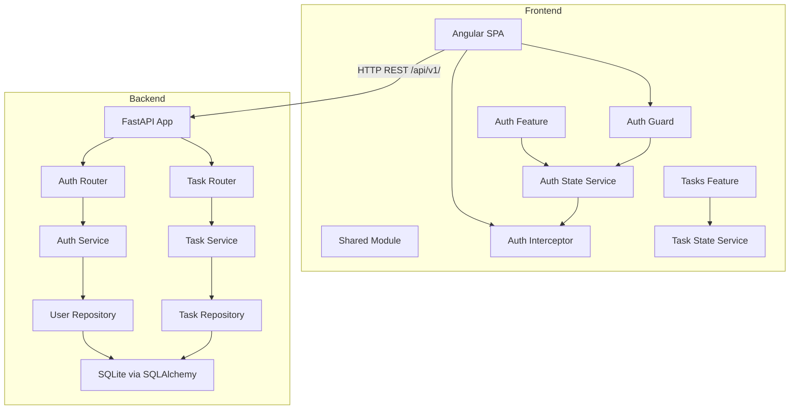
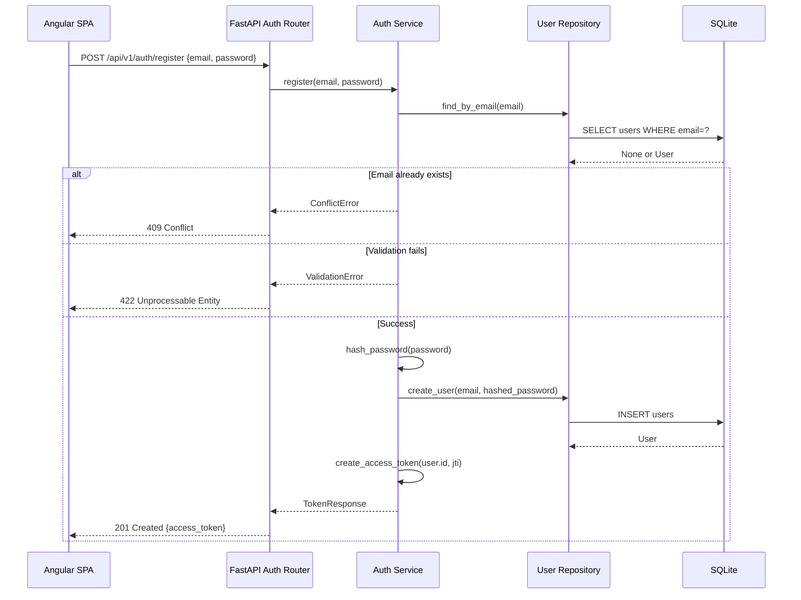
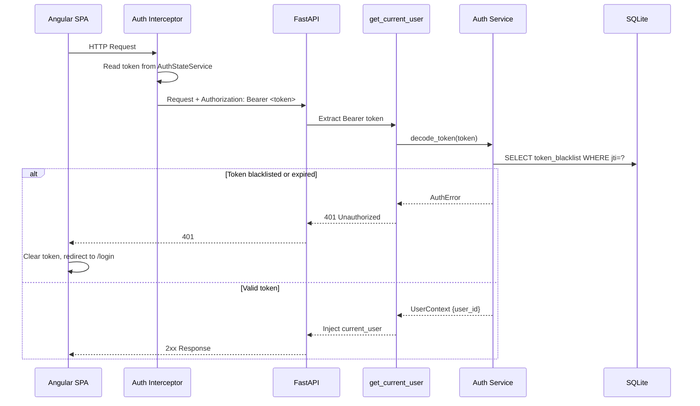
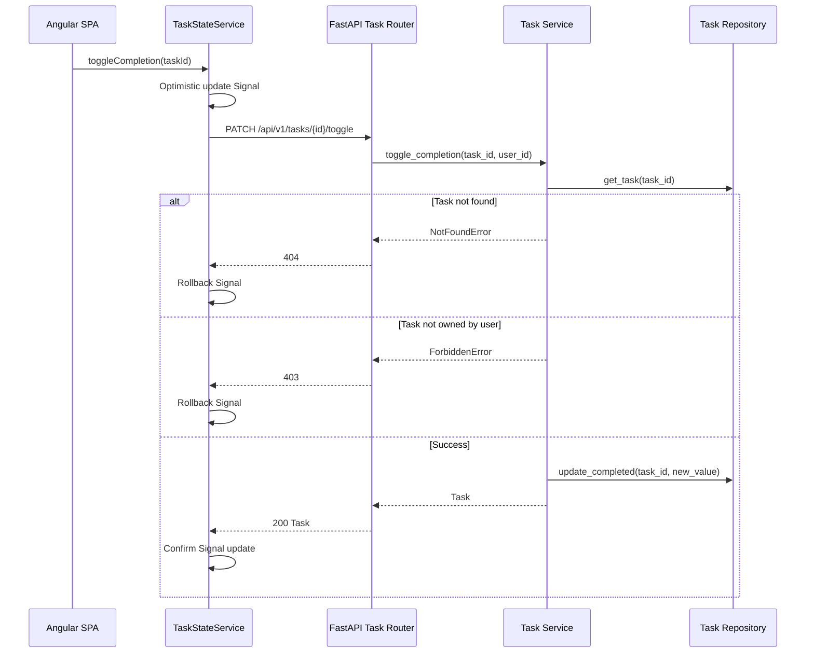
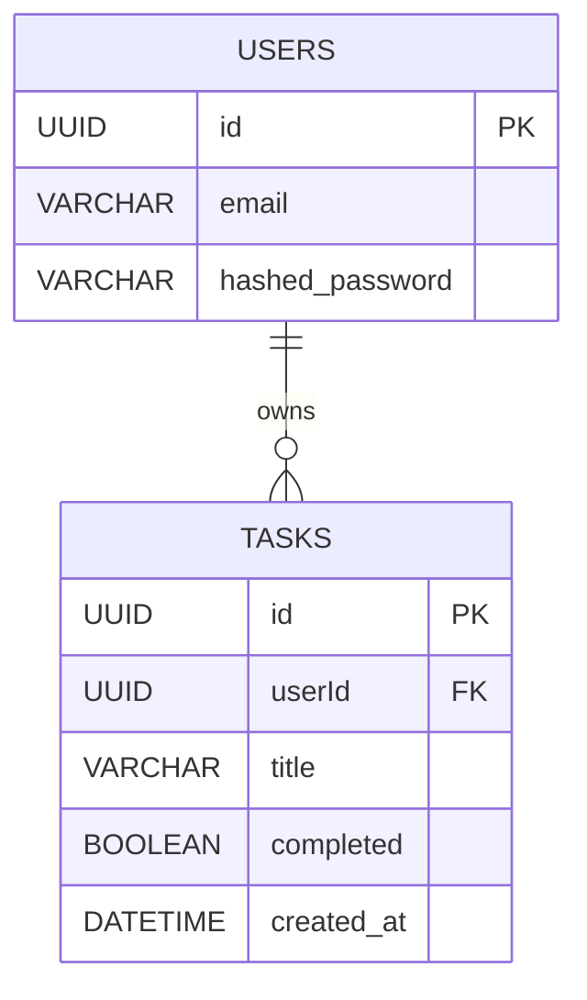
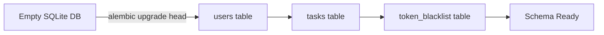

# Technical Design Document — todo-app-fullstack

---

## Overview

This feature delivers a full-stack Todo application composed of a FastAPI backend service and an Angular frontend. The system allows users to self-register, authenticate using JWT, and perform complete task lifecycle management (create, list, filter, update, toggle completion, and delete).

The backend exposes a versioned RESTful API (`/api/v1/`) with automatic OpenAPI documentation. The frontend is a single-page application that stores the JWT in localStorage, attaches it automatically to every authenticated request via an HTTP interceptor, and enforces route protection via Angular guards. All source code is cleanly separated into `backend/` and `frontend/` directories.

**Users**: Registered end-users interact with the Angular SPA to manage personal task lists. Developers interact with the OpenAPI docs at `/docs` for API exploration and with Alembic CLI for schema management.

---

### Goals

- Implement a complete user registration and JWT-based authentication flow (requirements 1, 2).
- Implement full CRUD task management scoped to the authenticated user (requirements 3–7).
- Deliver a reactive Angular SPA with route protection, session persistence, and optimistic UI updates (requirement 8).
- Establish a clean project structure with versioned API, auto-generated OpenAPI spec, and Alembic-managed schema (requirements 9, 10).

### Non-Goals

- Refresh token issuance or silent token renewal.
- Multi-tenant or admin role management.
- Production deployment configuration (Docker, cloud hosting).
- Real-time task synchronization (WebSockets).
- Task due dates, priorities, labels, or subtasks.

---

## Architecture

### Architecture Pattern & Boundary Map

The backend follows a **Layered Architecture** (Router → Service → Repository). Each layer has a single responsibility and depends only on the layer directly below it. The frontend follows a **Feature-Module pattern** (auth feature, tasks feature, shared module) using Angular standalone components and Signals for reactive state.



**Architecture Integration**:
- Selected pattern: Layered (backend) + Feature-Module with Signals (frontend). Rationale in `research.md`.
- Domain boundaries: Auth domain owns user identity and token lifecycle; Tasks domain owns task CRUD scoped by userId.
- New components rationale: Each component maps 1:1 to a clear responsibility without cross-cutting ownership.
- Steering compliance: No steering files found; design follows industry-standard FastAPI and Angular idioms.

### Technology Stack

| Layer | Choice / Version | Role in Feature | Notes |
|-------|------------------|-----------------|-------|
| Frontend | Angular 17+ | SPA, routing, reactive UI with Signals | Standalone component API, functional interceptors and guards |
| Backend | FastAPI 0.111+ | HTTP API, OpenAPI generation, dependency injection | `python-jose[cryptography]`, `passlib[bcrypt]` |
| ORM | SQLAlchemy 2.x (sync) | Database access layer, model definitions | Sync mode chosen for simplicity with SQLite and Alembic |
| Migrations | Alembic 1.13+ | Schema versioning, startup migration runner | `alembic upgrade head` called in FastAPI lifespan |
| Database | SQLite | Persistent storage for users and tasks | UUID PKs stored as VARCHAR(36) |
| Auth | JWT via python-jose | Token issuance, validation, claims extraction | 30-minute access token TTL; `jti` for blacklist support |
| Password | passlib bcrypt | Password hashing and constant-time verification | `CryptContext(schemes=["bcrypt"])` |

Extended rationale and rejected alternatives are documented in `research.md`.

---

## System Flows

### Registration Flow



### Authentication and Request Flow



### Task Completion Toggle Flow



---

## Requirements Traceability

| Requirement | Summary | Components | Interfaces | Flows |
|-------------|---------|------------|------------|-------|
| 1.1–1.5 | User registration with validation, hashing, token response | `AuthService`, `UserRepository`, `Auth Router` | `POST /api/v1/auth/register` | Registration Flow |
| 2.1–2.5 | Login, token issuance, expiry, logout with blacklist | `AuthService`, `UserRepository`, `Auth Router` | `POST /api/v1/auth/login`, `POST /api/v1/auth/logout` | Auth and Request Flow |
| 3.1–3.4 | Task creation with UUID assignment, validation, ownership | `TaskService`, `TaskRepository`, `Task Router` | `POST /api/v1/tasks` | — |
| 4.1–4.5 | Task listing with user isolation, status filter, loading/empty state | `TaskService`, `TaskRepository`, `TaskStateService` | `GET /api/v1/tasks?status=` | — |
| 5.1–5.3 | Task title update with ownership check and validation | `TaskService`, `TaskRepository`, `Task Router` | `PUT /api/v1/tasks/{id}` | — |
| 6.1–6.4 | Completion toggle with ownership check, optimistic UI update | `TaskService`, `TaskRepository`, `TaskStateService` | `PATCH /api/v1/tasks/{id}/toggle` | Toggle Flow |
| 7.1–7.4 | Task deletion with ownership check, frontend list update | `TaskService`, `TaskRepository`, `TaskStateService` | `DELETE /api/v1/tasks/{id}` | — |
| 8.1–8.5 | Token auto-attach, route guard, 401 handling, localStorage persistence | `AuthInterceptor`, `AuthGuard`, `AuthStateService` | Angular HTTP pipeline | Auth and Request Flow |
| 9.1–9.6 | Project structure, versioned API, OpenAPI spec, CORS | All backend routers, `FastAPI App` | `/api/v1/*`, `/docs` | — |
| 10.1–10.5 | Alembic migrations, startup runner, reversible scripts | `Alembic config`, `FastAPI lifespan` | `alembic upgrade head` | — |

---

## Components and Interfaces

### Component Summary

| Component | Domain/Layer | Intent | Req Coverage | Key Dependencies (P0/P1) | Contracts |
|-----------|--------------|--------|--------------|--------------------------|-----------|
| Auth Router | Backend / HTTP | Auth HTTP endpoints | 1.1–1.5, 2.1–2.5 | AuthService (P0) | API |
| Task Router | Backend / HTTP | Task HTTP endpoints | 3.1–3.4, 4.1–4.3, 5.1–5.3, 6.1–6.3, 7.1–7.3 | TaskService (P0), get_current_user (P0) | API |
| AuthService | Backend / Business | Token and password logic | 1.1–1.5, 2.1–2.5 | UserRepository (P0), python-jose (P0), passlib (P0) | Service |
| TaskService | Backend / Business | Task CRUD with ownership | 3.1–7.3 | TaskRepository (P0) | Service |
| UserRepository | Backend / Data | User persistence | 1.1–1.5, 2.1–2.2 | SQLAlchemy Session (P0) | Service |
| TaskRepository | Backend / Data | Task persistence | 3.1–7.3 | SQLAlchemy Session (P0) | Service |
| get_current_user | Backend / Dependency | JWT validation dependency | 2.1–2.5, 3–8 | AuthService (P0) | Service |
| AuthStateService | Frontend / State | Token storage and state | 8.1–8.5 | localStorage (P0) | State |
| AuthInterceptor | Frontend / HTTP | Token auto-attachment | 8.1, 8.5 | AuthStateService (P0) | Service |
| AuthGuard | Frontend / Routing | Route protection | 8.2, 8.3 | AuthStateService (P0) | Service |
| TaskStateService | Frontend / State | Task list reactive state | 4.4, 6.4, 7.4 | HttpClient (P0) | State |
| LoginComponent | Frontend / UI | Login form | 2.1–2.2 | AuthStateService (P1) | — |
| RegisterComponent | Frontend / UI | Registration form | 1.1–1.3 | AuthStateService (P1) | — |
| TaskListComponent | Frontend / UI | Task list with filter, loading, empty state | 4.4–4.5 | TaskStateService (P0) | — |
| TaskItemComponent | Frontend / UI | Single task row with toggle/delete | 6.4, 7.4 | TaskStateService (P0) | — |

---

### Backend / HTTP Layer

#### Auth Router

| Field | Detail |
|-------|--------|
| Intent | Expose HTTP endpoints for registration, login, and logout |
| Requirements | 1.1–1.5, 2.1–2.5 |

**Responsibilities & Constraints**
- Delegates all business logic to `AuthService`.
- Does not access the database directly.
- Mounted under `/api/v1/auth`.

**Dependencies**
- Outbound: `AuthService` — auth operations (P0)
- External: FastAPI `APIRouter` — routing and validation

**Contracts**: API [x]

##### API Contract

| Method | Endpoint | Request Body | Response | Errors |
|--------|----------|-------------|----------|--------|
| POST | `/api/v1/auth/register` | `RegisterRequest` | `201 TokenResponse` | 409 email in use, 422 validation |
| POST | `/api/v1/auth/login` | `LoginRequest` | `200 TokenResponse` | 401 invalid credentials, 422 |
| POST | `/api/v1/auth/logout` | — (Bearer token required) | `200 MessageResponse` | 401 unauthorized |

**Implementation Notes**
- Integration: FastAPI validates request bodies via Pydantic models automatically.
- Validation: Email format and minimum password length enforced at Pydantic layer before reaching `AuthService`.
- Risks: Ensure `401` response on login never discloses whether email or password was incorrect (requirement 2.2).

---

#### Task Router

| Field | Detail |
|-------|--------|
| Intent | Expose HTTP endpoints for task CRUD, filtered listing, and completion toggle |
| Requirements | 3.1–3.4, 4.1–4.3, 5.1–5.3, 6.1–6.3, 7.1–7.3 |

**Responsibilities & Constraints**
- All endpoints require authentication via `get_current_user` dependency injection.
- `user_id` is always sourced from the validated token, never from the request body.
- Mounted under `/api/v1/tasks`.

**Dependencies**
- Outbound: `TaskService` — task operations (P0)
- Inbound: `get_current_user` — injects authenticated user context (P0)

**Contracts**: API [x]

##### API Contract

| Method | Endpoint | Request Body / Query | Response | Errors |
|--------|----------|---------------------|----------|--------|
| POST | `/api/v1/tasks` | `CreateTaskRequest` | `201 TaskResponse` | 422 empty title |
| GET | `/api/v1/tasks` | `?status=pending\|completed` (optional) | `200 TaskListResponse` | 401 |
| PUT | `/api/v1/tasks/{task_id}` | `UpdateTaskRequest` | `200 TaskResponse` | 403 not owner, 404 not found, 422 |
| PATCH | `/api/v1/tasks/{task_id}/toggle` | — | `200 TaskResponse` | 403 not owner, 404 not found |
| DELETE | `/api/v1/tasks/{task_id}` | — | `200 MessageResponse` | 403 not owner, 404 not found |

**Implementation Notes**
- Integration: `task_id` path parameter is a UUID string; validate UUID format at router level.
- Validation: `title` must be non-empty string; enforced by Pydantic `min_length=1`.
- Risks: Task ownership check must occur in `TaskService` before any mutation; router must not bypass this check.

---

### Backend / Business Layer

#### AuthService

| Field | Detail |
|-------|--------|
| Intent | Hash passwords, issue JWT access tokens, validate tokens, manage token blacklist |
| Requirements | 1.1–1.5, 2.1–2.5 |

**Responsibilities & Constraints**
- Owns all cryptographic operations (hashing, JWT encoding/decoding).
- Issues tokens with `sub` (user UUID), `exp`, `iat`, and `jti` (UUID) claims.
- Checks `token_blacklist` table on every token validation.
- Writes to `token_blacklist` on logout and prunes expired entries lazily.

**Dependencies**
- Outbound: `UserRepository` — user lookup and creation (P0)
- External: `python-jose[cryptography]` — JWT operations (P0)
- External: `passlib[bcrypt]` — password hashing (P0)
- Outbound: SQLAlchemy Session — blacklist table access (P0)

**Contracts**: Service [x]

##### Service Interface

```python
class AuthService:
    def register(self, email: str, password: str) -> TokenResponse: ...
    # Raises: ConflictError if email exists, ValidationError if constraints fail

    def login(self, email: str, password: str) -> TokenResponse: ...
    # Raises: AuthenticationError (never discloses email vs password mismatch)

    def logout(self, jti: str, expires_at: datetime) -> None: ...
    # Adds jti to token_blacklist

    def decode_token(self, token: str) -> TokenPayload: ...
    # Raises: AuthenticationError if expired, blacklisted, or malformed

    def hash_password(self, password: str) -> str: ...
    def verify_password(self, plain: str, hashed: str) -> bool: ...
```

- Preconditions: `password` minimum 8 characters; `email` valid format (enforced upstream by Pydantic).
- Postconditions: `register` returns a valid `TokenResponse`; `decode_token` returns `TokenPayload` with non-expired claims.
- Invariants: Plaintext passwords never stored or logged.

**Implementation Notes**
- Integration: `get_current_user` FastAPI dependency calls `decode_token` and returns `UserContext`.
- Validation: Pydantic validates email/password shape at the router layer before `AuthService` is called.
- Risks: Token blacklist grows without bound; prune expired entries during every `logout` call.

---

#### TaskService

| Field | Detail |
|-------|--------|
| Intent | Implement task CRUD business rules with user ownership enforcement |
| Requirements | 3.1–3.4, 4.1–4.3, 5.1–5.3, 6.1–6.3, 7.1–7.3 |

**Responsibilities & Constraints**
- All mutations verify that `task.userId == current_user.id` before proceeding.
- UUIDs for new tasks are generated at the service layer, not by the database.
- Default `completed = False` on creation.
- Task list is ordered by `created_at DESC` by default.

**Dependencies**
- Outbound: `TaskRepository` — persistence (P0)

**Contracts**: Service [x]

##### Service Interface

```python
class TaskService:
    def create_task(self, user_id: UUID, title: str) -> Task: ...
    # Raises: ValidationError if title is empty

    def list_tasks(self, user_id: UUID, status: TaskStatus | None = None) -> list[Task]: ...
    # Returns tasks ordered by created_at DESC, filtered by status if provided

    def update_task(self, task_id: UUID, user_id: UUID, title: str) -> Task: ...
    # Raises: NotFoundError, ForbiddenError, ValidationError

    def toggle_completion(self, task_id: UUID, user_id: UUID) -> Task: ...
    # Raises: NotFoundError, ForbiddenError

    def delete_task(self, task_id: UUID, user_id: UUID) -> None: ...
    # Raises: NotFoundError, ForbiddenError
```

- Preconditions: `user_id` is a validated UUID from the JWT token.
- Postconditions: Mutations return the updated/created `Task` entity.
- Invariants: A user never sees or modifies another user's tasks.

**Implementation Notes**
- Validation: `title` is validated as non-empty before calling repository.
- Risks: Ownership check must always precede `TaskRepository` mutations; never perform the DB update then check ownership.

---

### Backend / Data Layer

#### UserRepository

| Field | Detail |
|-------|--------|
| Intent | Persist and retrieve user records |
| Requirements | 1.1–1.5, 2.1–2.2 |

**Responsibilities & Constraints**
- Owns the `users` table.
- Enforces unique email constraint at the database level.

**Dependencies**
- Outbound: SQLAlchemy `Session` (P0)

**Contracts**: Service [x]

##### Service Interface

```python
class UserRepository:
    def find_by_email(self, email: str) -> User | None: ...
    def find_by_id(self, user_id: UUID) -> User | None: ...
    def create(self, email: str, hashed_password: str) -> User: ...
```

**Implementation Notes**
- Integration: SQLAlchemy `Session` is injected via FastAPI dependency.
- Risks: Catch `IntegrityError` from duplicate email and re-raise as `ConflictError` at service layer.

---

#### TaskRepository

| Field | Detail |
|-------|--------|
| Intent | Persist and retrieve task records |
| Requirements | 3.1–7.3 |

**Dependencies**
- Outbound: SQLAlchemy `Session` (P0)

**Contracts**: Service [x]

##### Service Interface

```python
class TaskRepository:
    def create(self, user_id: UUID, task_id: UUID, title: str) -> Task: ...
    def list_by_user(self, user_id: UUID, status: TaskStatus | None) -> list[Task]: ...
    def get_by_id(self, task_id: UUID) -> Task | None: ...
    def update(self, task: Task) -> Task: ...
    def delete(self, task: Task) -> None: ...
```

**Implementation Notes**
- Integration: `list_by_user` applies `WHERE userId = :user_id` and optional `completed` filter; orders by `created_at DESC`.
- Risks: Always filter by `user_id` in list queries; never expose a bare `SELECT * FROM tasks`.

---

### Backend / Dependency

#### get_current_user

| Field | Detail |
|-------|--------|
| Intent | FastAPI dependency that extracts and validates the JWT, returning the authenticated user context |
| Requirements | 2.1–2.5, 3–8 (all authenticated endpoints) |

**Responsibilities & Constraints**
- Uses `OAuth2PasswordBearer` to extract the Bearer token from the `Authorization` header.
- Calls `AuthService.decode_token()` which validates expiry and blacklist.
- Returns a `UserContext` dataclass injected into protected route handlers.

**Contracts**: Service [x]

##### Service Interface

```python
class UserContext:
    user_id: UUID
    jti: str

async def get_current_user(
    token: str = Depends(oauth2_scheme),
    auth_service: AuthService = Depends(get_auth_service),
) -> UserContext: ...
# Raises: HTTPException(401) on invalid/expired/blacklisted token
```

---

### Frontend / State

#### AuthStateService

| Field | Detail |
|-------|--------|
| Intent | Single source of truth for authentication token on the frontend; persists to localStorage |
| Requirements | 8.1–8.5 |

**Responsibilities & Constraints**
- Reads token from localStorage on service initialization.
- Exposes a Signal `isAuthenticated: Signal<boolean>` and `token: Signal<string | null>`.
- Clears localStorage and resets signal on `logout()` or `clearSession()`.

**Dependencies**
- External: Browser `localStorage` (P0)

**Contracts**: State [x]

##### State Management

```typescript
interface AuthState {
  token: string | null;
  isAuthenticated: boolean;
}

class AuthStateService {
  readonly token: Signal<string | null>;
  readonly isAuthenticated: Signal<boolean>;

  setToken(token: string): void;
  clearSession(): void;
  getToken(): string | null;
}
```

- State model: Writable Signal initialized from `localStorage.getItem('auth_token')`.
- Persistence: Token written to `localStorage` on `setToken`; removed on `clearSession`.
- Concurrency strategy: Signal updates are synchronous; no concurrent access concern in single-thread browser environment.

**Implementation Notes**
- Integration: `AuthInterceptor` reads `getToken()` on every outgoing request. `AuthGuard` reads `isAuthenticated`.
- Risks: If the JWT in localStorage is tampered, `get_current_user` on the backend will reject it with 401 and `clearSession()` will be called by the interceptor.

---

#### TaskStateService

| Field | Detail |
|-------|--------|
| Intent | Manage reactive task list state; orchestrate API calls and optimistic UI updates |
| Requirements | 4.4, 4.5, 6.4, 7.4 |

**Responsibilities & Constraints**
- Holds tasks as `Signal<Task[]>`.
- Exposes loading and empty states.
- Applies optimistic updates for toggle and delete; rolls back on API error.

**Dependencies**
- Outbound: Angular `HttpClient` — API calls (P0)
- Outbound: `AuthStateService` — indirectly via interceptor (P1)

**Contracts**: State [x]

##### State Management

```typescript
interface TaskState {
  tasks: Task[];
  loading: boolean;
  filter: 'all' | 'pending' | 'completed';
}

class TaskStateService {
  readonly tasks: Signal<Task[]>;
  readonly loading: Signal<boolean>;
  readonly filter: WritableSignal<'all' | 'pending' | 'completed'>;

  loadTasks(): Observable<void>;
  createTask(title: string): Observable<Task>;
  updateTask(taskId: string, title: string): Observable<Task>;
  toggleCompletion(taskId: string): Observable<Task>;
  deleteTask(taskId: string): Observable<void>;
}
```

- State model: `Signal<TaskState>` updated after successful API responses.
- Optimistic update: `toggleCompletion` and `deleteTask` update the Signal before the API call; rollback occurs in the error handler.
- Persistence: No client-side persistence; tasks are fetched fresh on navigation to the tasks route.

**Implementation Notes**
- Integration: `loadTasks` is called in `TaskListComponent.ngOnInit`.
- Risks: Optimistic rollback must restore the original snapshot, not re-fetch from the API, to avoid race conditions.

---

### Frontend / HTTP

#### AuthInterceptor

| Field | Detail |
|-------|--------|
| Intent | Attach Authorization header to every outgoing HTTP request when a token is available |
| Requirements | 8.1, 8.5 |

**Contracts**: Service [x]

##### Service Interface

```typescript
const authInterceptor: HttpInterceptorFn = (req, next) => {
  // Reads token from AuthStateService
  // Clones request with Authorization: Bearer <token>
  // On 401 response: calls AuthStateService.clearSession() and redirects to /login
};
```

**Implementation Notes**
- Integration: Registered via `provideHttpClient(withInterceptors([authInterceptor]))` in `app.config.ts`.
- Risks: Auth endpoints (`/api/v1/auth/register`, `/api/v1/auth/login`) do not need the token; the interceptor adds the header to all requests — the backend ignores it for unauthenticated endpoints.

---

### Frontend / Routing

#### AuthGuard

| Field | Detail |
|-------|--------|
| Intent | Prevent unauthenticated access to protected routes; redirect to login on expired session |
| Requirements | 8.2, 8.3 |

**Contracts**: Service [x]

##### Service Interface

```typescript
const authGuard: CanActivateFn = (route, state) => {
  // Checks AuthStateService.isAuthenticated signal
  // If false: redirect to /login (with optional session-expiry notification)
  // If true: allow navigation
};
```

**Implementation Notes**
- Integration: Applied to task-management routes in the Angular router configuration.
- Risks: JWT expiry is checked server-side on every request; client-side guard only validates token presence. The 401 interceptor handles mid-session expiry (requirement 8.3).

---

### Frontend / UI (Presentation Components)

Presentation components have no new boundaries. They receive data via Input signals or inject `TaskStateService`/`AuthStateService` for actions.

| Component | Intent | Requirements | Implementation Note |
|-----------|--------|-------------|---------------------|
| `LoginComponent` | Login form, calls `AuthStateService.setToken` on success | 2.1–2.2 | Reactive form with email and password fields; displays generic error on 401 |
| `RegisterComponent` | Registration form, calls `AuthStateService.setToken` on success | 1.1–1.3 | Reactive form; displays field-level validation errors from API 422 response |
| `TaskListComponent` | Renders task list, filter controls, loading indicator, empty state | 4.4–4.5 | Reads `TaskStateService.tasks` and `loading` Signals |
| `TaskItemComponent` | Single task row with title, completion toggle, edit, and delete | 6.4, 7.4 | Emits toggle/delete to `TaskStateService`; optimistic update happens in service |

---

## Data Models

### Domain Model

Two aggregates:

- **User** — aggregate root; owns its identity and credential. Invariant: email is unique across the system.
- **Task** — aggregate root; owned by a User via `userId`. Invariant: `userId` always references an existing User. `title` is never empty. `completed` defaults to `false`.

No domain events are required at this scope.

### Logical Data Model



**Consistency & Integrity**:
- `tasks.userId` is a foreign key referencing `users.id` with `ON DELETE CASCADE`.
- `email` has a `UNIQUE` constraint.
- `title` has a `NOT NULL` constraint.
- `completed` defaults to `FALSE`.
- `created_at` is set at insert time (`server_default=func.now()`); never updated.

### Physical Data Model (SQLite)

**Table: users**

| Column | Type | Constraints |
|--------|------|-------------|
| id | VARCHAR(36) | PRIMARY KEY |
| email | VARCHAR(255) | NOT NULL, UNIQUE |
| hashed_password | VARCHAR(255) | NOT NULL |

**Table: tasks**

| Column | Type | Constraints |
|--------|------|-------------|
| id | VARCHAR(36) | PRIMARY KEY |
| userId | VARCHAR(36) | NOT NULL, FK → users.id ON DELETE CASCADE |
| title | VARCHAR(255) | NOT NULL |
| completed | BOOLEAN | NOT NULL, DEFAULT FALSE |
| created_at | DATETIME | NOT NULL, DEFAULT CURRENT_TIMESTAMP |

**Table: token_blacklist**

| Column | Type | Constraints |
|--------|------|-------------|
| jti | VARCHAR(36) | PRIMARY KEY |
| expires_at | DATETIME | NOT NULL |

Index: `token_blacklist.expires_at` (to support efficient lazy pruning).

**Indexes**:
- `tasks(userId)` — speeds up per-user list queries.
- `tasks(userId, completed)` — speeds up filtered list queries (requirement 4.3).

### Data Contracts & Integration

**Request/Response schemas** (Pydantic models on backend, TypeScript interfaces on frontend):

```python
# Backend Pydantic schemas
class RegisterRequest(BaseModel):
    email: EmailStr
    password: str  # min_length=8

class LoginRequest(BaseModel):
    email: EmailStr
    password: str

class TokenResponse(BaseModel):
    access_token: str
    token_type: str = "bearer"

class CreateTaskRequest(BaseModel):
    title: str  # min_length=1

class UpdateTaskRequest(BaseModel):
    title: str  # min_length=1

class TaskResponse(BaseModel):
    id: str
    userId: str
    title: str
    completed: bool

class TaskListResponse(BaseModel):
    tasks: list[TaskResponse]

class MessageResponse(BaseModel):
    message: str
```

```typescript
// Frontend TypeScript interfaces
interface TokenResponse {
  access_token: string;
  token_type: string;
}

interface Task {
  id: string;
  userId: string;
  title: string;
  completed: boolean;
}

interface CreateTaskRequest {
  title: string;
}

interface UpdateTaskRequest {
  title: string;
}

type TaskStatus = 'pending' | 'completed';

interface ApiError {
  detail: string | ValidationErrorDetail[];
}

interface ValidationErrorDetail {
  loc: string[];
  msg: string;
  type: string;
}
```

---

## Error Handling

### Error Strategy

The backend uses a structured error hierarchy. `AuthenticationError`, `ConflictError`, `NotFoundError`, `ForbiddenError`, and `ValidationError` are domain exceptions raised by services and translated to HTTP responses by FastAPI exception handlers registered in `app.py`.

### Error Categories and Responses

**User Errors (4xx)**:
- `400 Bad Request` — malformed request structure not caught by Pydantic.
- `401 Unauthorized` — invalid, expired, or blacklisted token; also returned for invalid login credentials (requirement 2.2 — must not indicate whether email or password was wrong).
- `403 Forbidden` — task ownership violation (requirements 5.2, 6.3, 7.2).
- `404 Not Found` — task ID does not exist (requirement 7.3).
- `409 Conflict` — email already in use (requirement 1.2).
- `422 Unprocessable Entity` — Pydantic validation failure (requirements 1.3, 3.2, 5.3).

**System Errors (5xx)**:
- `500 Internal Server Error` — unhandled exceptions; logged server-side; generic message returned to client.

**Frontend Error Handling**:
- HTTP interceptor catches `401` globally: clear token, redirect to `/login`, display session-expiry notification (requirement 8.3, 8.5).
- Forms display field-level messages from `422` `detail` array.
- Task operations display inline error messages on failure; optimistic updates roll back automatically.

### Monitoring

- Backend: Python `logging` module at `INFO` level for request lifecycle; `ERROR` level for exceptions. Log includes request method, path, status code, and user ID (not token).
- Frontend: Angular `ErrorHandler` override logs unexpected errors to the browser console.

---

## Testing Strategy

### Unit Tests (Backend)

- `AuthService.register`: valid registration, duplicate email, weak password.
- `AuthService.login`: valid credentials, invalid email, invalid password (must return same error).
- `AuthService.decode_token`: valid token, expired token, blacklisted token.
- `TaskService.create_task`: valid title, empty title.
- `TaskService.toggle_completion`: owner toggles, non-owner attempt (expect ForbiddenError).

### Integration Tests (Backend)

- `POST /api/v1/auth/register` → `POST /api/v1/auth/login` → `GET /api/v1/tasks` end-to-end with real SQLite in-memory DB.
- Task ownership: create task as user A, attempt update/delete as user B → expect 403.
- Token expiry: decode expired token → expect 401.
- Alembic migration: run `upgrade head` against empty DB, verify table schema.

### Unit Tests (Frontend)

- `AuthStateService`: `setToken` persists to localStorage, `clearSession` removes from localStorage.
- `AuthGuard`: returns `true` when token present, redirects when absent.
- `AuthInterceptor`: attaches `Authorization` header when token set, calls `clearSession` on 401.
- `TaskStateService.toggleCompletion`: applies optimistic update, rolls back on error.

### E2E Tests

- Full registration → login → create task → toggle → delete flow.
- Unauthenticated navigation to `/tasks` → redirect to `/login`.
- Session persistence: reload page with valid token → tasks still accessible.

---

## Security Considerations

- **Password storage**: bcrypt via `passlib` with default work factor (12). Plaintext never logged or returned (requirement 1.4).
- **Token security**: JWT signed with `HS256` secret (configurable via environment variable `SECRET_KEY`). Minimum 32-character random secret required.
- **Token blacklist**: logout invalidates the `jti` claim server-side (requirement 2.5).
- **Ownership enforcement**: `userId` is always sourced from the validated JWT, never from request body. This prevents horizontal privilege escalation.
- **CORS**: `CORSMiddleware` configured to allow only the Angular dev origin (`http://localhost:4200`) by default. Production origin must be set via environment variable (requirement 9.5).
- **Generic error messages**: Login returns identical error for invalid email and invalid password (requirement 2.2) to prevent user enumeration.
- **Input validation**: All inputs validated by Pydantic before reaching service layer.

---

## Migration Strategy

The initial Alembic migration creates all three tables in a single script (`001_initial_schema.py`).



- Each migration includes both `upgrade()` and `downgrade()` functions (requirement 10.5).
- FastAPI lifespan startup event calls `alembic.command.upgrade(cfg, "head")` before the first request is accepted (requirement 10.3).
- Migration scripts reside in `backend/alembic/versions/` (requirement 10.1).
- Rollback trigger: `alembic downgrade -1` reverses the most recent migration.

---

## Supporting References

### Project Directory Structure

```
backend/
  alembic/
    versions/
      001_initial_schema.py
    env.py
  app/
    main.py            # FastAPI app, lifespan, CORS, router registration
    dependencies.py    # get_current_user, get_db session
    routers/
      auth.py
      tasks.py
    services/
      auth_service.py
      task_service.py
    repositories/
      user_repository.py
      task_repository.py
    models/
      user.py          # SQLAlchemy ORM model
      task.py
      token_blacklist.py
    schemas/
      auth.py          # Pydantic request/response models
      tasks.py
    core/
      config.py        # Settings (SECRET_KEY, token TTL, DB URL)
      exceptions.py    # Domain exception classes
  alembic.ini
  requirements.txt

frontend/
  src/
    app/
      app.config.ts    # provideRouter, provideHttpClient, interceptors
      app.routes.ts    # Route definitions with authGuard
      auth/
        login/
          login.component.ts
        register/
          register.component.ts
        services/
          auth-state.service.ts
          auth-api.service.ts
        guards/
          auth.guard.ts
        interceptors/
          auth.interceptor.ts
      tasks/
        task-list/
          task-list.component.ts
        task-item/
          task-item.component.ts
        services/
          task-state.service.ts
          task-api.service.ts
      shared/
        models/
          task.model.ts
          auth.model.ts
  angular.json
  package.json
```
