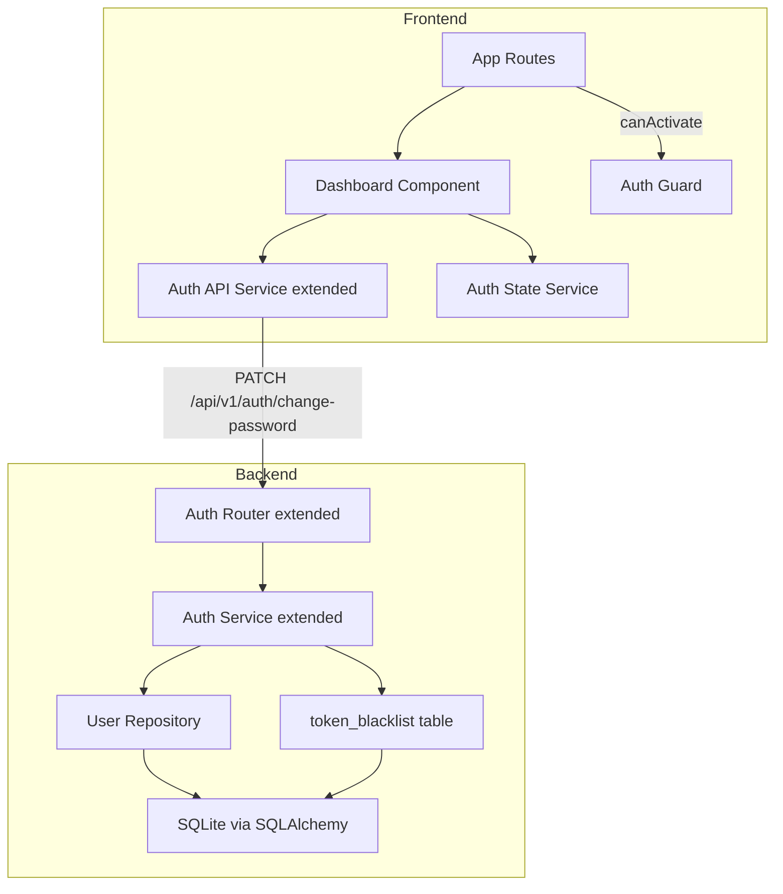
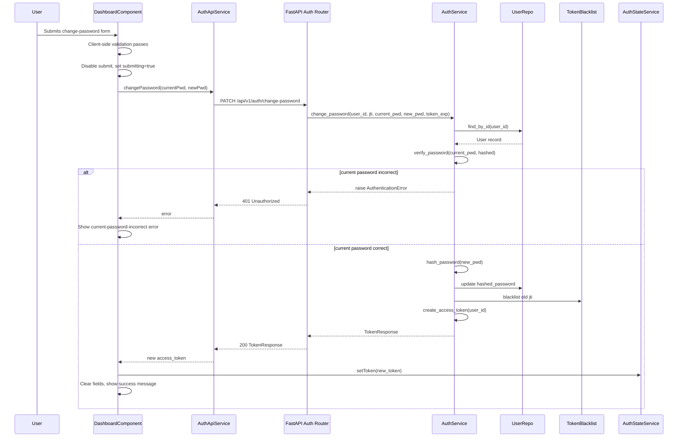

# Technical Design Document — user-dashboard-change-password

---

## Overview

This feature delivers a User Dashboard page to authenticated users of the Todo application. The dashboard displays the user's account information (email as read-only) and provides a change-password form with three fields: current password, new password, and confirm new password.

The implementation extends the existing Angular frontend with a new standalone component and a new API service, and extends the FastAPI backend with a single new endpoint. No new external dependencies or database schema migrations are required. All patterns mirror those established in the `todo-app-fullstack` baseline: Layered Architecture on the backend (Router → Service → Repository) and standalone Angular components with Signals on the frontend.

**Users**: Registered, authenticated end-users access the dashboard from a link in the task list navigation to view their email and update their password.

**Impact**: Adds one new protected frontend route (`/dashboard`), one new backend endpoint (`PATCH /api/v1/auth/change-password`), and a new `change_password` method on `AuthService`. The existing `token_blacklist` table is reused to invalidate the old JWT on successful password change. No other existing components are modified beyond adding a navigation link.

---

### Goals

- Provide a protected `/dashboard` route displaying the authenticated user's email in read-only form (1.1, 1.2, 1.3, 1.4).
- Display a change-password form with current password, new password, and confirm new password fields (2.1, 2.2, 2.3, 2.4).
- Validate all inputs client-side before submission: required fields, password match, and password policy (3.1, 3.2, 3.3, 3.4).
- Process the password change request server-side, verify the current password, update the hashed password, and invalidate the old JWT (4.1, 4.2, 4.3, 4.4, 4.5).
- Enforce session security: HTTPS-only transmission, masked fields, session expiry redirect, and token invalidation after password change (5.1, 5.2, 5.3, 5.4).

### Non-Goals

- User profile editing beyond email display (email is read-only).
- Password reset via email (forgot-password flow).
- Multi-factor authentication.
- Force re-login after password change (new token is issued and stored automatically).
- Pagination or history of password changes.

---

## Architecture

### Existing Architecture Analysis

The baseline establishes:

- **Backend**: FastAPI with `Router → Service → Repository` layering. Domain exceptions (`AuthenticationError`, `ValidationError`) are raised in services and handled globally in `main.py`. All auth logic lives in `AuthService`; user persistence in `UserRepository`. Token blacklisting is already implemented for logout using the `token_blacklist` table.
- **Frontend**: Angular 21 standalone components using `ReactiveFormsModule` and `FormBuilder` for forms. API calls are in `*ApiService` classes (injected via `inject()`); reactive state lives in `*StateService` classes using Angular Signals. Route protection is handled by `authGuard`. The `authInterceptor` automatically attaches the Bearer token and clears the session on `401`.
- **Token lifecycle**: `AuthStateService` stores the JWT in `localStorage`. `AuthStateService.setToken()` replaces the token; `clearSession()` removes it. The `token_blacklist` table holds blacklisted JTIs.

### Architecture Pattern & Boundary Map



**Architecture Integration**:

- Selected pattern: Layered Architecture (unchanged) + Feature-Module pattern (unchanged).
- New components: `DashboardComponent` (frontend UI), `change_password` method on `AuthService` (backend service), `PATCH /api/v1/auth/change-password` endpoint (backend router).
- Existing patterns preserved: `authGuard` route protection, `authInterceptor` for 401 handling, `ReactiveFormsModule` + `FormBuilder` for forms, `*ApiService` / `*StateService` separation, domain exception hierarchy.
- Steering compliance: No steering files are defined; design aligns with established patterns from the `todo-app-fullstack` spec.

### Technology Stack

| Layer | Choice / Version | Role in Feature | Notes |
|-------|------------------|-----------------|-------|
| Frontend | Angular 21, TypeScript 5.9 | Dashboard page, change-password form, reactive state | Existing stack; no new dependencies |
| Frontend Forms | `@angular/forms` ReactiveFormsModule | Form validation and submission | Existing; `Validators` + custom cross-field validator |
| Frontend HTTP | `@angular/common/http` HttpClient | `PATCH /api/v1/auth/change-password` call | Existing; `authInterceptor` injects Bearer token automatically |
| Backend | FastAPI, Python 3.9 | New `PATCH` endpoint and service method | Existing stack |
| Backend Auth | python-jose (HS256), passlib (bcrypt) | Verify current password, hash new password, decode token for blacklisting | Existing; no version changes |
| Data / Storage | SQLite via SQLAlchemy, Alembic | Read/update `users.hashed_password`; write to `token_blacklist` | No schema migration needed |

---

## System Flows

### Password Change Sequence



Key decisions: The old JWT is blacklisted immediately upon successful password change (mirrors logout). A new token is issued and stored transparently so the user remains on the dashboard without forced re-login. Client-side validation (empty fields, password match, min-length) prevents the round trip for obvious errors.

### Session Expiry Redirect

The existing `authInterceptor` handles `401` responses on non-auth endpoints by calling `authState.clearSession()` and navigating to `/login`. This covers requirement 5.3 without any additional code in the dashboard component.

---

## Requirements Traceability

| Requirement | Summary | Components | Interfaces | Flows |
|-------------|---------|------------|------------|-------|
| 1.1 | Dashboard accessible to authenticated users | `DashboardComponent`, `AppRoutes` | Route `/dashboard` with `canActivate: [authGuard]` | — |
| 1.2 | Email displayed read-only | `DashboardComponent` | `AuthStateService.token` decoded client-side or `UserProfileResponse` from API | — |
| 1.3 | Unauthenticated access redirects to login | `authGuard`, `AppRoutes` | `authGuard` returns `router.createUrlTree(['/login'])` | — |
| 1.4 | Email field visually disabled/read-only | `DashboardComponent` | HTML `disabled` attribute on email input | — |
| 2.1 | Three-field change-password form | `DashboardComponent` | `FormGroup` with `currentPassword`, `newPassword`, `confirmNewPassword` controls | — |
| 2.2 | All password fields masked | `DashboardComponent` | `type="password"` on all three inputs | — |
| 2.3 | Submit button visible | `DashboardComponent` | `[disabled]` binding on submit button | — |
| 2.4 | Form shown only when authenticated | `DashboardComponent`, `authGuard` | Route guard prevents unauthenticated access | — |
| 3.1 | Required field validation | `DashboardComponent` | `Validators.required` on all three controls | — |
| 3.2 | New password match validation | `DashboardComponent` | Cross-field `passwordsMatchValidator` | — |
| 3.3 | Password policy enforcement | `DashboardComponent`, `AuthService` | `Validators.minLength(8)` client-side; `ValidationError` server-side | — |
| 3.4 | Submit enabled only when valid | `DashboardComponent` | `[disabled]="form.invalid \|\| submitting"` | — |
| 4.1 | Submit sends current + new password to auth service | `AuthApiService`, `AuthRouter`, `AuthService` | `PATCH /api/v1/auth/change-password` | Password Change Sequence |
| 4.2 | Incorrect current password returns error | `AuthService`, `AuthRouter`, `DashboardComponent` | `AuthenticationError` → 401 | Password Change Sequence |
| 4.3 | Success confirmation message | `DashboardComponent` | `successMessage` signal | Password Change Sequence |
| 4.4 | Fields cleared on success | `DashboardComponent` | `form.reset()` after success | Password Change Sequence |
| 4.5 | Loading state during submission | `DashboardComponent` | `submitting` flag disables button | Password Change Sequence |
| 5.1 | HTTPS transmission | Infrastructure / `authInterceptor` | Enforced at infrastructure level; Angular proxy / backend HTTPS | — |
| 5.2 | Password values never in plain text | `DashboardComponent` | `type="password"` inputs; never logged | — |
| 5.3 | Session expiry redirect | `authInterceptor` | Existing 401 handler clears session and navigates to `/login` | Session Expiry Redirect |
| 5.4 | Old token invalidated on password change | `AuthService`, `TokenBlacklist` | `logout()` pattern reused; new token issued | Password Change Sequence |

---

## Components and Interfaces

### Summary

| Component | Domain/Layer | Intent | Req Coverage | Key Dependencies (P0/P1) | Contracts |
|-----------|--------------|--------|--------------|--------------------------|-----------|
| `DashboardComponent` | Frontend / UI | Displays email and change-password form; orchestrates validation and submission | 1.1–1.4, 2.1–2.4, 3.1–3.4, 4.3–4.5, 5.2 | `AuthApiService` (P0), `AuthStateService` (P0) | State |
| `AuthApiService` (extended) | Frontend / HTTP | Adds `changePassword` method for `PATCH /api/v1/auth/change-password` | 4.1 | `HttpClient` (P0) | API |
| `AuthRouter` (extended) | Backend / HTTP | Adds `PATCH /change-password` endpoint | 4.1, 4.2 | `AuthService` (P0), `get_current_user` (P0) | API |
| `AuthService` (extended) | Backend / Service | Adds `change_password` method: verify, update, blacklist, reissue | 4.1, 4.2, 5.4 | `UserRepository` (P0), `TokenBlacklist` (P0) | Service |
| `UserRepository` (extended) | Backend / Repository | Adds `update_password` method to persist new hashed password | 4.1 | `Session`, `User` model (P0) | Service |

---

### Frontend / UI

#### DashboardComponent

| Field | Detail |
|-------|--------|
| Intent | Renders the user dashboard with read-only email display and change-password form |
| Requirements | 1.1, 1.2, 1.3, 1.4, 2.1, 2.2, 2.3, 2.4, 3.1, 3.2, 3.3, 3.4, 4.3, 4.4, 4.5, 5.2 |

**Responsibilities & Constraints**

- Displays the authenticated user's email address in a disabled text input (sourced from `UserProfileResponse` returned by `GET /api/v1/auth/me`).
- Renders `currentPassword`, `newPassword`, and `confirmNewPassword` as masked inputs using `type="password"`.
- Applies client-side validation: `Validators.required` on all three controls, `Validators.minLength(8)` on `newPassword` and `confirmNewPassword`, and a cross-field `passwordsMatchValidator` on the group.
- Manages a `submitting` boolean flag to disable the submit button and show a loading label during the API call.
- On success: displays a `successMessage`, resets the form (clears all password fields), and stores the new token via `AuthStateService.setToken()`.
- On error: maps HTTP status codes to user-facing messages without exposing raw server errors.
- Does not persist or log any password field values.

**Dependencies**

- Inbound: `AppRoutes` activates via `authGuard` (P0)
- Outbound: `AuthApiService.changePassword()` — triggers password change (P0)
- Outbound: `AuthApiService.getProfile()` — fetches email on init (P0)
- Outbound: `AuthStateService.setToken()` — stores new token on success (P0)
- External: `@angular/forms` ReactiveFormsModule — form management (P1)

**Contracts**: State [x]

##### State Management

- State model: `submitting: boolean` (plain property); `successMessage: string | null` (plain property); `serverError: string | null` (plain property). Form state managed by `FormGroup`.
- Persistence: No state persisted; `AuthStateService` handles token storage.
- Concurrency: `submitting` flag prevents duplicate submissions. Form is reset after success.

**Implementation Notes**

- Integration: Register the component as a lazy-loaded route in `app.routes.ts` at path `'dashboard'` with `canActivate: [authGuard]`. Add a navigation link in `TaskListComponent` header (alongside the Logout button).
- Validation: `passwordsMatchValidator` is a synchronous `ValidatorFn` applied at the `FormGroup` level that compares `newPassword.value` and `confirmNewPassword.value`; it sets a `passwordsMismatch` error on the group.
- Risks: JWT decoding client-side to extract the email is possible (JWT payload is Base64; no secret needed for reading) but couples the component to the JWT structure. Prefer `GET /api/v1/auth/me` endpoint to keep the frontend decoupled from token internals. If the `me` endpoint is added in a separate task, the component must load email on `ngOnInit`.

---

### Frontend / HTTP

#### AuthApiService (extended)

| Field | Detail |
|-------|--------|
| Intent | Extends existing service with a `changePassword` method and a `getProfile` method |
| Requirements | 4.1, 1.2 |

**Responsibilities & Constraints**

- Adds `changePassword` calling `PATCH /api/v1/auth/change-password` and returning an `Observable<string>` (the new access token).
- Adds `getProfile` calling `GET /api/v1/auth/me` and returning an `Observable<UserProfile>`.
- Follows the existing pattern: `inject(HttpClient)`, `.pipe(map(...))`, no error handling inside the service (delegated to component).

**Dependencies**

- Inbound: `DashboardComponent` (P0)
- External: `HttpClient` — HTTP transport (P0); `authInterceptor` attaches Bearer automatically (P0)

**Contracts**: API [x]

##### API Contract

| Method | Endpoint | Request | Response | Errors |
|--------|----------|---------|----------|--------|
| PATCH | `/api/v1/auth/change-password` | `ChangePasswordRequest` | `TokenResponse` (`access_token`, `token_type`) | 400, 401, 422 |
| GET | `/api/v1/auth/me` | — (Bearer token) | `UserProfileResponse` (`email`) | 401 |

##### Service Interface

```typescript
interface ExtendedAuthApiService {
  changePassword(
    currentPassword: string,
    newPassword: string
  ): Observable<string>; // resolves to new access_token

  getProfile(): Observable<UserProfile>;
}

interface UserProfile {
  email: string;
}

interface ChangePasswordRequest {
  current_password: string;
  new_password: string;
}
```

**Implementation Notes**

- Integration: Add methods to the existing `AuthApiService` class. No new service class required.
- Validation: None inside the service; validation is the component's responsibility.
- Risks: None. Follows the exact pattern already in place for `login` and `register`.

---

### Backend / HTTP

#### AuthRouter (extended)

| Field | Detail |
|-------|--------|
| Intent | Adds `PATCH /change-password` and `GET /me` endpoints to the existing auth router |
| Requirements | 4.1, 4.2, 1.2 |

**Responsibilities & Constraints**

- Delegates all business logic to `AuthService`.
- Extracts the current token via the existing `_oauth2_scheme` for JTI blacklisting.
- Returns `TokenResponse` on success (new token).
- Maps `AuthenticationError` → 401, `ValidationError` → 422 via existing global exception handlers.

**Dependencies**

- Inbound: Angular `AuthApiService` over HTTPS (P0)
- Outbound: `AuthService.change_password()` (P0)
- Outbound: `get_current_user` dependency (P0)

**Contracts**: API [x]

##### API Contract

| Method | Endpoint | Auth | Request Body | Response | Errors |
|--------|----------|------|--------------|----------|--------|
| PATCH | `/api/v1/auth/change-password` | Bearer | `ChangePasswordRequest` | `TokenResponse` (200) | 401 wrong current password, 422 policy violation, 401 unauthenticated |
| GET | `/api/v1/auth/me` | Bearer | — | `UserProfileResponse` (200) | 401 unauthenticated |

**Request/Response Schemas (Python)**

```python
class ChangePasswordRequest(BaseModel):
    current_password: str
    new_password: str

    @field_validator("new_password")
    @classmethod
    def new_password_min_length(cls, v: str) -> str:
        if len(v) < 8:
            raise ValueError("Password must be at least 8 characters long.")
        return v

class UserProfileResponse(BaseModel):
    email: str
```

**Implementation Notes**

- Integration: Add the two new route functions to the existing `backend/app/routers/auth.py` module. Reuse `_oauth2_scheme` (already declared) for token extraction in `change-password`.
- Validation: Pydantic validates `new_password` minimum length; `AuthService` validates the current password.
- Risks: The `PATCH /change-password` endpoint must receive the raw token (via `_oauth2_scheme`) so it can extract `exp` for the blacklist entry, mirroring the logout endpoint pattern.

---

### Backend / Service

#### AuthService (extended)

| Field | Detail |
|-------|--------|
| Intent | Adds `change_password` method and a `get_user_email` helper |
| Requirements | 4.1, 4.2, 5.4, 1.2 |

**Responsibilities & Constraints**

- `change_password(user_id, jti, expires_at, current_password, new_password)`:
  1. Fetches user via `user_repo.find_by_id(user_id)`.
  2. Calls `verify_password(current_password, user.hashed_password)` — raises `AuthenticationError("Current password is incorrect.")` on failure.
  3. Calls `hash_password(new_password)` to produce new hash.
  4. Calls `user_repo.update_password(user_id, new_hash)`.
  5. Calls `logout(jti=jti, expires_at=expires_at)` to blacklist the old token.
  6. Creates and returns a new `TokenResponse` via `create_access_token(user_id)`.
- `get_user_email(user_id)`: fetches user and returns `email`; raises `NotFoundError` if not found.

**Dependencies**

- Inbound: `AuthRouter` (P0)
- Outbound: `UserRepository.find_by_id()`, `UserRepository.update_password()` (P0)
- Outbound: `TokenBlacklist` table via `logout()` (P0)

**Contracts**: Service [x]

##### Service Interface

```python
class AuthService:
    def change_password(
        self,
        user_id: str,
        jti: str,
        expires_at: datetime,
        current_password: str,
        new_password: str,
    ) -> dict[str, str]:
        """
        Preconditions:
          - user_id corresponds to an existing User record.
          - current_password is the user's active password.
          - new_password satisfies the minimum 8-character policy.
        Postconditions:
          - users.hashed_password is updated to bcrypt(new_password).
          - Old JTI is blacklisted in token_blacklist.
          - Returns a new TokenResponse dict.
        Raises:
          - AuthenticationError if current_password verification fails.
          - NotFoundError if user_id is not found.
        """
        ...

    def get_user_email(self, user_id: str) -> str:
        """
        Preconditions: user_id corresponds to an existing User.
        Postconditions: Returns the email string.
        Raises: NotFoundError if user_id is not found.
        """
        ...
```

**Implementation Notes**

- Integration: Add the two new methods to the existing `AuthService` class in `backend/app/services/auth_service.py`. Call `self.logout()` (already implemented) for blacklisting.
- Validation: `AuthenticationError` is raised for wrong current password; the global exception handler in `main.py` translates it to HTTP 401 automatically.
- Risks: If `user_repo.update_password()` succeeds but the subsequent `logout()` commit fails (e.g., DB error), the password is changed but the old token remains valid. Mitigation: perform both writes within a single DB transaction (not a structural change, handled in implementation).

---

### Backend / Repository

#### UserRepository (extended)

| Field | Detail |
|-------|--------|
| Intent | Adds `update_password` method to persist a new hashed password for a user |
| Requirements | 4.1 |

**Responsibilities & Constraints**

- `update_password(user_id, new_hashed_password)`: fetches the user, updates `hashed_password`, commits, returns the updated `User`.
- Raises `NotFoundError` if the user is not found (defensive; `AuthService` already validates this).

**Dependencies**

- Inbound: `AuthService` (P0)
- External: SQLAlchemy `Session`, `User` ORM model (P0)

**Contracts**: Service [x]

##### Service Interface

```python
class UserRepository:
    def update_password(
        self,
        user_id: str,
        new_hashed_password: str,
    ) -> User:
        """
        Preconditions: user_id exists in the users table.
        Postconditions: users.hashed_password updated and committed.
        Raises: NotFoundError if user_id not found.
        """
        ...
```

**Implementation Notes**

- Integration: Add `update_password` to the existing `UserRepository` class in `backend/app/repositories/user_repository.py`.
- Risks: None beyond standard DB commit failure. No new constraints or indexes required.

---

## Data Models

### Domain Model

No new aggregates or entities are introduced. The `User` entity gains a mutable `hashed_password` attribute. Password change is treated as an update operation within the `User` aggregate root.

- **Value objects**: `ChangePasswordCommand` (conceptual, not a persisted object) carries `user_id`, `jti`, `expires_at`, `current_password`, `new_password`.
- **Domain event**: `PasswordChanged` — triggers old-token blacklisting and new-token issuance within the same `AuthService.change_password()` call.
- **Invariant**: `users.hashed_password` must always be a valid bcrypt hash; it is never set to a plaintext value.

### Logical Data Model

No schema changes. The feature reads from and writes to existing tables:

| Table | Operation | Columns Accessed |
|-------|-----------|-----------------|
| `users` | SELECT by `id`, UPDATE `hashed_password` | `id`, `email`, `hashed_password` |
| `token_blacklist` | INSERT | `jti`, `expires_at` |

### Data Contracts & Integration

**`PATCH /api/v1/auth/change-password` — Request**

```json
{
  "current_password": "string (required)",
  "new_password": "string (required, min_length=8)"
}
```

**`PATCH /api/v1/auth/change-password` — Response (200 OK)**

```json
{
  "access_token": "string (JWT)",
  "token_type": "bearer"
}
```

**`GET /api/v1/auth/me` — Response (200 OK)**

```json
{
  "email": "string"
}
```

**Error envelope** (consistent with existing API):
```json
{ "detail": "string" }
```

---

## Error Handling

### Error Strategy

Client-side validation runs synchronously before any HTTP call. Server-side errors are mapped by the component to user-facing messages. The existing `authInterceptor` handles session expiry globally.

### Error Categories and Responses

**User Errors (4xx)**:

| Scenario | HTTP Status | User Message | Req |
|----------|------------|--------------|-----|
| Current password incorrect | 401 | "The current password you entered is incorrect." | 4.2 |
| New password too short | 422 | "Password must be at least 8 characters." | 3.3 |
| Any required field empty | Client-side | Per-field "This field is required." | 3.1 |
| Passwords do not match | Client-side | "New password and confirmation do not match." | 3.2 |
| Unauthenticated / token expired | 401 (interceptor) | Redirect to `/login` | 5.3 |

**System Errors (5xx)**:

| Scenario | Behavior |
|----------|----------|
| Unexpected server error | Display generic message "An unexpected error occurred. Please try again." |
| DB commit failure | 500; user sees generic error; no partial state (transaction atomicity handles rollback) |

**Business Logic Errors (422)**:

Pydantic `ValidationError` returned as `{"detail": "..."}` with HTTP 422. The component maps this to the appropriate field-level or server-level message.

### Monitoring

- All 4xx/5xx responses on `/api/v1/auth/change-password` are logged by FastAPI's default request logging.
- No new metrics required beyond existing patterns.

---

## Testing Strategy

### Unit Tests

- `AuthService.change_password()` with correct current password → verifies `update_password` called, `logout` called, new token returned.
- `AuthService.change_password()` with incorrect current password → raises `AuthenticationError`.
- `UserRepository.update_password()` → verifies `hashed_password` updated in DB.
- `passwordsMatchValidator` (Angular) → valid when passwords match; `passwordsMismatch` error when they differ.
- `DashboardComponent` form validation → required field errors, min-length errors, match errors, submit disabled when invalid.

### Integration Tests

- `PATCH /api/v1/auth/change-password` with valid payload → 200 with new token, `hashed_password` updated in DB, old JTI blacklisted.
- `PATCH /api/v1/auth/change-password` with wrong current password → 401, `hashed_password` unchanged.
- `PATCH /api/v1/auth/change-password` without Bearer token → 401.
- `GET /api/v1/auth/me` with valid token → 200 with email.
- Using old token after successful password change → 401 (token blacklisted).

### E2E / UI Tests

- Navigate to `/dashboard` unauthenticated → redirected to `/login`.
- Navigate to `/dashboard` authenticated → email is displayed and read-only.
- Submit change-password form with empty fields → per-field validation errors shown.
- Submit with mismatched passwords → mismatch error shown, form not submitted.
- Submit with valid data → success message shown, password fields cleared.
- Submit with incorrect current password → server error message shown.

---

## Security Considerations

- **Password transmission**: Password fields are submitted via HTTPS only (`type="password"` + TLS at infrastructure level). The `authInterceptor` attaches Bearer tokens automatically; no password values are stored in component state beyond the `FormGroup`.
- **Token invalidation**: The old JWT is blacklisted using the existing `token_blacklist` mechanism immediately upon successful password change (5.4). The new token is issued and stored atomically from the user's perspective.
- **Current password verification**: `AuthService.verify_password()` uses passlib's bcrypt with constant-time comparison, preventing timing attacks.
- **Password policy**: Minimum 8 characters enforced at both client (Angular `Validators.minLength(8)`) and server (Pydantic `field_validator`) layers (3.3).
- **No email disclosure**: `GET /api/v1/auth/me` returns only the authenticated user's own email; `get_current_user` dependency enforces ownership.
- **Error messages**: Wrong current password returns a generic 401 without disclosing whether the user exists (mirrors the login endpoint pattern).
